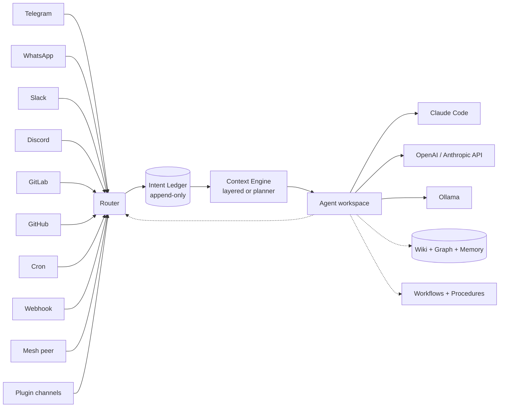

# AgentX

**The AI operations layer for small & medium businesses.** Plug in the channels your team already uses — Telegram, WhatsApp, Slack, Discord, GitLab, GitHub — set schedules, and watch your agents work. Web wizard for non-technical operators, CLI for engineers. Self-hosted.

## Who it's for

**Small & medium businesses running AI agents on real channels.** Support queues, devops squads, ops teams, internal automation. You want multiple agents handling different jobs, coordinating across machines, answering on the tools your people already use — without standing up a ML platform or hiring dedicated infra.

- **Non-technical operators** add agents, connect channels, and schedule jobs from a browser wizard and `/admin` panel — no JSON editing.
- **Engineers** get a full CLI, `agentx.json`, scoped API tokens, mesh federation, plugins, an append-only intent ledger, and a mutateConfig-safe write path.

> **Running AgentX solo for yourself?** [OpenClaw](https://github.com/openclaw/openclaw) is built for single-user assistants and has a lighter install path. If you outgrow it, we import your config — see [Migrate from OpenClaw](docs/migration/from-openclaw.md).

## What you get out of the box

**Channels & routing**
- **Telegram, WhatsApp, Slack, Discord, GitLab, GitHub, generic webhooks** — one config, all channels. Pair WhatsApp with a QR code in the browser.
- **Cross-channel `/send`** — agents reply on the channel they received on, or push to any other channel programmatically.
- **Mesh federation** — agents on different machines collaborate over Tailscale/VPN. Manage any peer's config from one dashboard.

**Operator surface**
- **Browser-based setup wizard + 11-page admin dashboard** — add agents, wire channels, mint scoped tokens, drag-drop Kanban, intent-graph triage, workflow editor — all without editing JSON.
- **`agentx setup`** — opens the wizard from the terminal; safe to re-run, only writes deltas.
- **`agentx doctor`** — pre-flight health check that catches missing keys, unreachable daemons, expired tokens, misconfigured channels.

**Work pool & backlog**
- **Backlog import + two-way sync** — `agentx backlog import` pulls open issues from GitLab/GitHub with autocomplete-multiselect; mutations on imported items push assignee/labels/title/description/milestone/state back upstream.
- **Boards (Kanban)** — column-based view over GitLab projects with drag-drop, scoped-label transitions, stale-Doing reconciler.

**Agents are folders, not code**
- Each agent has its own persona, knowledge, and tools in plain Markdown — `CLAUDE.md`, `.claude/skills/`, optional `references/`.
- **Bring your own AI** — Claude Code (subscription, full features), Anthropic / OpenAI API, Ollama, or anything in between.

**Workflows & procedures** ([when to reach for them](docs/llm-workflows.md))
- **Declarative state machines in YAML or JSON** under `.agentx/workflows/`, with a visual editor in the dashboard. Triggers from any channel; user-task forms render to Telegram/WhatsApp/Slack/web. *Use when you need pause-resume across days, cross-agent state that survives restarts, or an operator-visible diagram. Otherwise — write an agent prompt.*
- **Procedures** — versioned SOPs (`.agentx/procedures/<id>.md`) agents reference at runtime.
- **Deterministic services** — fixed-prompt handlers for known patterns (no LLM call when the answer is canonical).

**Scheduled work**
- **Plain-English cron** — `agentx schedule "every Monday at 9am" --agent sales`.
- `onError` pipeline that can both notify you AND auto-disable after N failures.

**Governance & observability**
- **Append-only intent ledger** — every dispatch decision recorded in SQLite; `agentx ledger replay` reproduces them deterministically (Phase 1–8 of the [architectural rescue](docs/journey/11-production-hardening.md)).
- **PM gating + typed capabilities + delegation-depth caps** — admission control auditable through the ledger.
- **Live dashboard + token-cost dashboard** — `/live`, `/processes`, `/inbox` for activity; `agentx usage serve` for tier-2 hotspots and per-agent cost.
- **Scoped API tokens** — time-bound, revocable bearer tokens with named scopes for external integrations.

**Extensibility**
- **Plugins** — drop-in npm packages register custom channel adapters and bus subscribers. `agentx plugin init <name>` scaffolds one.
- **MCP server** — `agentx serve --stdio` exposes the daemon to Claude Code, Cursor, Windsurf as a tool surface.

**Knowledge**
- **Wiki memory** — conversations compound into a shared, citable knowledge base each agent draws from. Agentic query at read time, daily absorb at write time. Typed article spine (`person / project / place / concept / event / decision / pattern`), `[[wikilinks]]` graph navigation, immutable `_versions/` snapshots, multi-agent permissions (`public / shared / private`).
- **MCP-exposed query** — Cursor, Claude Code, and Windsurf reach the wiki directly via the `agentx_wiki_query` tool. Agentic graph walk, not bag-of-words search.
- **Intent knowledge graph** — fixed-axis taxonomy fed by an LLM classifier with operator triage queue.

## Install

**One line:**

```bash
curl -fsSL https://raw.githubusercontent.com/anis-marrouchi/agentx/master/install.sh | bash
```

Installs the CLI and launches the web setup wizard — no YAML, no JSON.

**Docker:**

```bash
git clone https://github.com/anis-marrouchi/agentx.git && cd agentx
cp agentx.example.json agentx-data/agentx.json    # or run `agentx setup` later
docker compose up -d
```

**Manual:**

```bash
npm install -g agentix-cli
agentx setup               # opens the web wizard
```

Open the dashboard at **http://127.0.0.1:4202** — live agents, task history, Kanban boards, intent graph, workflow editor, and the `/admin` panel for managing agents, channels, tokens, and webhooks. A `?`-Glossary link is in the topbar if anything looks unfamiliar.

See the [full install guide](docs/install.md) for advanced setups, Tailscale binding, systemd, and TLS reverse proxy.

## Docs

Full documentation: **[https://agentx-docs.pages.dev](https://agentx-docs.pages.dev)** (or `pnpm docs:dev` locally).

**Start here:**
- [Install](docs/install.md) — from zero to a running daemon in 5 minutes
- [Concepts](docs/concepts.md) — what an agent, channel, schedule, and team network are (glossary also lives at `/glossary` in the dashboard)

**Worked examples, simple → advanced (12 chapters):**
- [1. Telegram Q&A bot](docs/journey/01-telegram-qa-bot.md) — one agent, one channel, one conversation
- [2. Scheduled reports with failure alerts](docs/journey/02-scheduled-reports.md)
- [3. Multi-agent group chat](docs/journey/03-multi-agent-group.md)
- [4. Cross-channel — GitLab MR → WhatsApp ping](docs/journey/04-cross-channel.md)
- [5. Hooks and webhooks](docs/journey/05-hooks-webhooks.md) — generic webhook receiver, hook events, signing
- [6. Shared wiki](docs/journey/06-shared-wiki.md) — knowledge that compounds
- [7. Run a team with AI agents](docs/journey/07-business-layer.md) — roles, KPIs, org chart
- [8. Two machines, one team](docs/journey/08-mesh-federation.md) — mesh federation
- [9. Deterministic services](docs/journey/09-deterministic-services.md) — workflows without LLM tokens
- [10. MCP server](docs/journey/10-mcp-server.md) — drive AgentX from Cursor / Claude Code
- [11. Production hardening](docs/journey/11-production-hardening.md) — permissions, debug, observability, incident playbook
- [12. BPM — grant application](docs/journey/12-bpm-grant-application.md)

**Operator playbooks:**
- [Backlog import + upstream sync](docs/playbooks/backlog-import-sync.md)
- [Plugin authoring](docs/playbooks/plugin-authoring.md)
- [PM gating — org-chart governance](docs/playbooks/pm-gating.md)
- [Capability audit — typed intents and delegation depth](docs/playbooks/capability-audit.md)
- [Tier-2 billing lifecycle](docs/playbooks/tier2-billing.md)

**Reference:**
- [CLI](docs/reference/cli.md) · [Config schema](docs/reference/config-schema.md) · [Communication matrix](docs/reference/communication-matrix.md)
- [Dashboard pillar](docs/reference/dashboard/) — every admin page documented (setup, live, boards, workflows, inbox, processes, intent graph, agent, admin, usage)
- [Workflows](docs/reference/workflows.md) · [Boards](docs/reference/boards.md) · [Intent graph](docs/reference/graph.md)
- [Scoped API tokens](docs/reference/tokens.md) · [Public agents](docs/reference/public-agents.md) · [`agentx doctor`](docs/reference/doctor.md)
- [Slack channel](docs/reference/slack.md) · [Tailscale mesh VPN](docs/reference/tailscale-setup.md) · [Rollback runbook](docs/reference/rollback-runbook.md)

**Moving from another tool:**
- [Migrate from OpenClaw](docs/migration/from-openclaw.md) — we import the bulk of your config in one shot

[Contributing](docs/contributing.md)

## Architecture



Each agent = a workspace directory with Claude Code configuration (`.claude/`, `CLAUDE.md`, skills, hooks, MCP servers). AgentX orchestrates when and where agents run, ledger-records every dispatch decision, and lets plugins extend the channel + bus surface.

## License

MIT.
