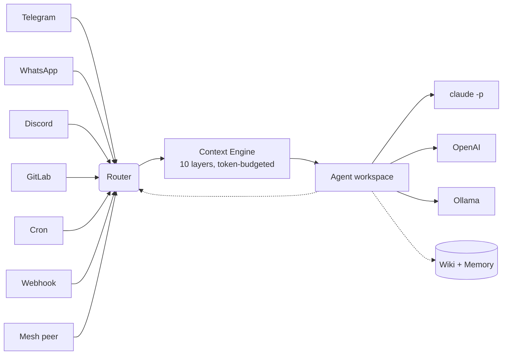

# AgentX

**Self-hosted multi-agent orchestrator.** Routes messages from Telegram, WhatsApp, Discord, GitLab, crons, webhooks, and cross-machine mesh to AI agents running on Claude Code, OpenAI, Ollama, or any LLM provider.

## Why AgentX?

Existing multi-agent frameworks (CrewAI, AutoGen, LangGraph) are SDK-first, Python-heavy, and cloud-dependent. AgentX is **infrastructure-first** — closer to systemd for AI agents than to another framework.

- **BYOAI** — Claude, OpenAI, Ollama, whatever
- **Agents = directories** — workspace + config. No code required
- **Channel routing** built in — Telegram, WhatsApp, Discord, GitLab, webhooks
- **Mesh federation** — agents across machines collaborate over Tailscale/VPN
- **Cron + business layer** — scheduled work with KPI tracking
- **Wiki memory** — compounding knowledge from conversations
- **Cross-channel `/send`** — receive on X, push to Y
- **Live monitoring** — SSE event stream, debug categories

## Install

```bash
npm install -g agentix-cli
agentx init
agentx agent add
agentx channel add
agentx daemon start
agentx daemon watch    # live, color-coded activity
```

## Read the docs

The full documentation lives at **[https://agentx-docs.pages.dev](https://agentx-docs.pages.dev)** (or run `pnpm docs:dev` locally).

- **[Install](docs/install.md)** — from zero to a running daemon in 5 minutes
- **[Concepts](docs/concepts.md)** — agents, channels, crons, mesh, wiki, business
- **Journey (simple → advanced):**
  - [1. Telegram Q&A bot](docs/journey/01-telegram-qa-bot.md)
  - [2. Scheduled reports with failure alerts](docs/journey/02-scheduled-reports.md)
  - [3. Multi-agent group chat](docs/journey/03-multi-agent-group.md)
  - [7. Business layer — run a team with AI agents](docs/journey/07-business-layer.md)
  - [8. Mesh federation — two machines, one team](docs/journey/08-mesh-federation.md)
- **Reference:**
  - [CLI](docs/reference/cli.md)
  - [Config schema](docs/reference/config-schema.md)
  - [Communication matrix](docs/reference/communication-matrix.md)
- **[Migrate from OpenClaw](docs/migration/from-openclaw.md)**
- **[Contributing](docs/contributing.md)**

## Architecture



Each agent = a workspace directory with Claude Code configuration (`.claude/`, `CLAUDE.md`, skills, hooks, MCP servers). AgentX orchestrates when and where agents run.

## License

MIT.
