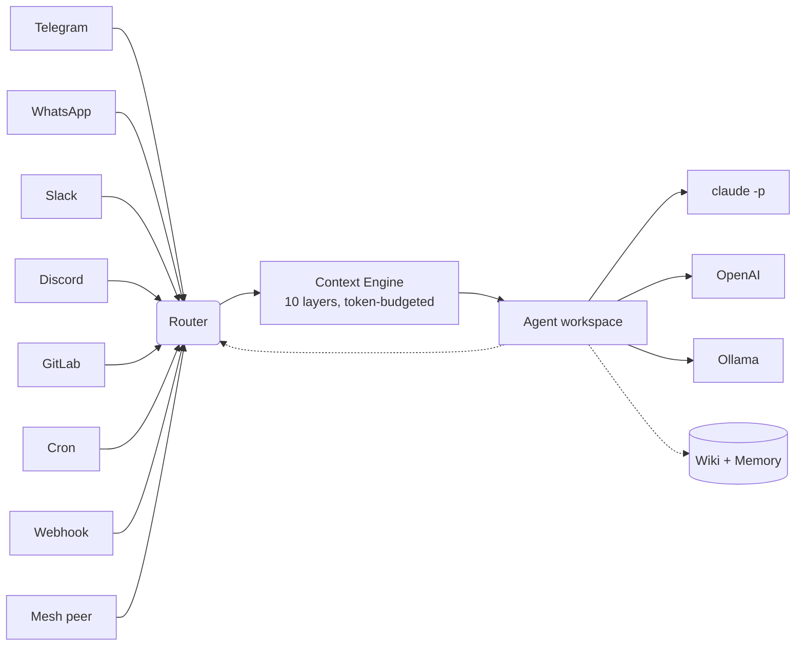

# AgentX

**The AI operations layer for small & medium businesses.** Plug in the channels your team already uses — Telegram, WhatsApp, Slack, Discord, GitLab — set schedules, and watch your agents work. Web wizard for non-technical operators, CLI for engineers. Self-hosted.

## Who it's for

**Small & medium businesses running AI agents on real channels.** Support queues, devops squads, ops teams, internal automation. You want multiple agents handling different jobs, coordinating across machines, answering on the tools your people already use — without standing up a ML platform or hiring dedicated infra.

- **Non-technical operators** add agents, connect channels, and schedule jobs from a browser wizard and `/admin` panel — no JSON editing.
- **Engineers** get a full CLI, `agentx.json`, scoped API tokens, mesh federation, and a mutateConfig-safe write path.

> **Running AgentX solo for yourself?** [OpenClaw](https://github.com/openclaw/openclaw) is built for single-user assistants and has a lighter install path. If you outgrow it, we import your config — see [Migrate from OpenClaw](docs/migration/from-openclaw.md).

## What you get out of the box

- **Answer on Telegram, WhatsApp, Slack, Discord, GitLab** — one config, all channels. Pair WhatsApp with a QR code in the browser.
- **Browser-based setup wizard + `/admin` panel** — add agents, wire channels, mint scoped API tokens, schedule crons, all without editing JSON
- **Agents = folders, not code** — each agent has its own persona, knowledge, and tools in plain Markdown
- **Multiple machines, one team** — mesh federation across laptops + servers; manage any peer's config from a single dashboard via the mesh selector
- **Scheduled jobs in plain English** — `agentx schedule "every Monday at 9am" --agent sales`
- **Live dashboard** — a browser view of what every agent is doing right now, with full task history, streaming output, and replay
- **Scoped API tokens** — let external apps message an agent with a time-bound, scope-limited token (see [Tokens](docs/reference/tokens.md) and [Public agents](docs/reference/public-agents.md))
- **`agentx doctor`** — pre-flight health check that catches missing keys, unreachable daemons, and misconfigured channels
- **Bring your own AI** — Claude Code (deep reasoning + tools), OpenAI / Anthropic API, Ollama, or anything in between
- **Wiki memory** — conversations compound into a shared knowledge base each agent draws from

## Install

**One line:**

```bash
curl -fsSL https://raw.githubusercontent.com/anis-marrouchi/agentx/master/install.sh | bash
```

Installs the CLI and launches the web setup wizard — no YAML, no JSON.

**Docker:**

```bash
git clone https://github.com/anis-marrouchi/agentx.git && cd agentx
cp agentx.example.json agentx-data/agentx.json    # or run `agentx setup` later
docker compose up -d
```

**Manual:**

```bash
npm install -g agentix-cli
agentx setup               # opens the web wizard
```

Open the dashboard at **http://127.0.0.1:4202** — live agents, task history, Kanban boards, and the `/admin` panel for managing agents, channels, and tokens. A `?`-Glossary link is in the topbar if anything looks unfamiliar.

See the [full install guide](docs/install.md) for advanced setups.

## Docs

Full documentation: **[https://agentx-docs.pages.dev](https://agentx-docs.pages.dev)** (or `pnpm docs:dev` locally).

**Start here:**
- [Install](docs/install.md) — from zero to a running daemon in 5 minutes
- [Concepts](docs/concepts.md) — what an agent, channel, schedule, and team network are (glossary also lives at `/glossary` in the dashboard)

**Worked examples, simple → advanced:**
- [1. Telegram Q&A bot](docs/journey/01-telegram-qa-bot.md) — one agent, one channel, one conversation
- [2. Scheduled reports with failure alerts](docs/journey/02-scheduled-reports.md)
- [3. Multi-agent group chat](docs/journey/03-multi-agent-group.md)
- [7. Run a team with AI agents](docs/journey/07-business-layer.md) — roles, KPIs, org chart
- [8. Two machines, one team](docs/journey/08-mesh-federation.md) — mesh federation

**For configuration:**
- [CLI reference](docs/reference/cli.md) · [Config schema](docs/reference/config-schema.md) · [Communication matrix](docs/reference/communication-matrix.md)
- [Scoped API tokens](docs/reference/tokens.md) — mint / scope / revoke
- [Public agents](docs/reference/public-agents.md) — expose an agent over HTTP
- [`agentx doctor`](docs/reference/doctor.md) — pre-flight health check
- [Slack channel](docs/reference/slack.md) — Socket Mode setup

**Moving from another tool:**
- [Migrate from OpenClaw](docs/migration/from-openclaw.md) — we import the bulk of your config in one shot

[Contributing](docs/contributing.md)

## Architecture



Each agent = a workspace directory with Claude Code configuration (`.claude/`, `CLAUDE.md`, skills, hooks, MCP servers). AgentX orchestrates when and where agents run.

## License

MIT.
