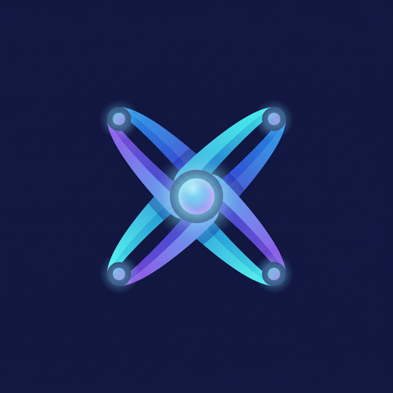
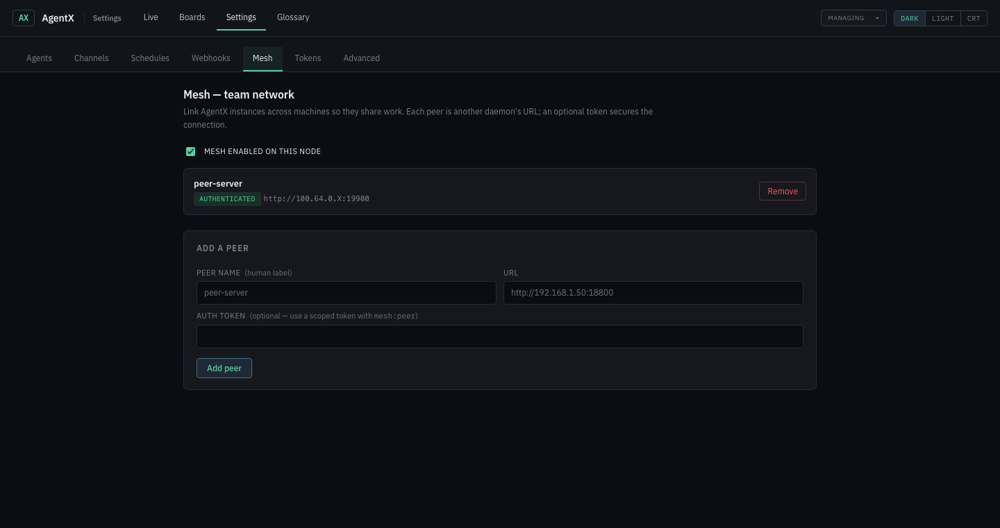
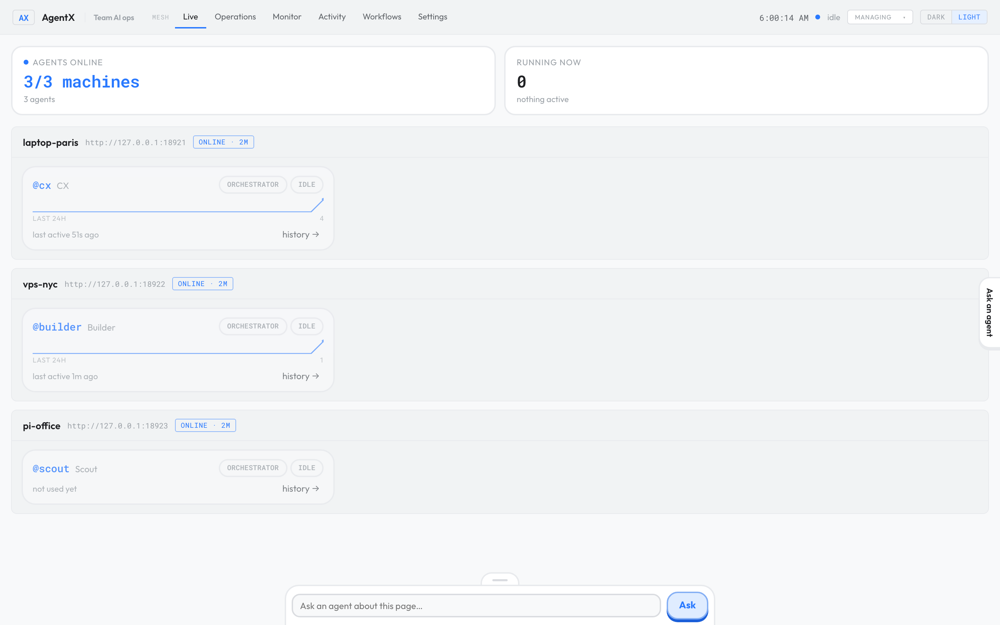
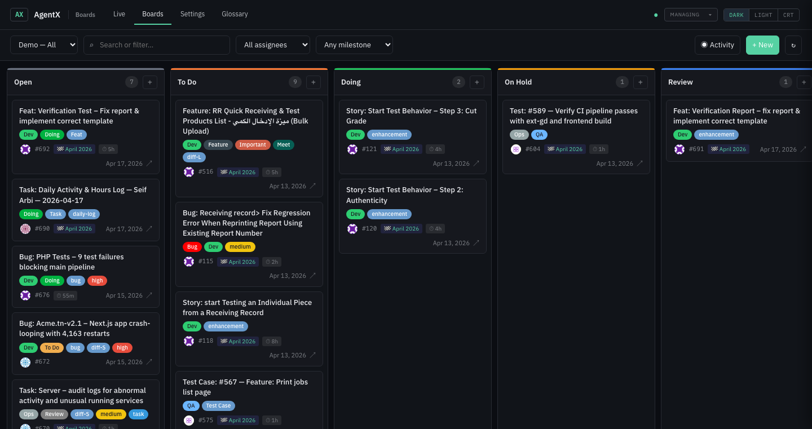
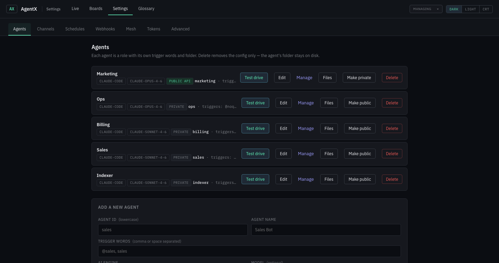
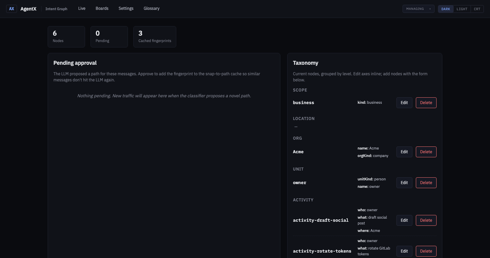
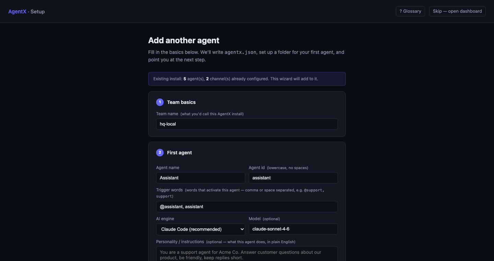
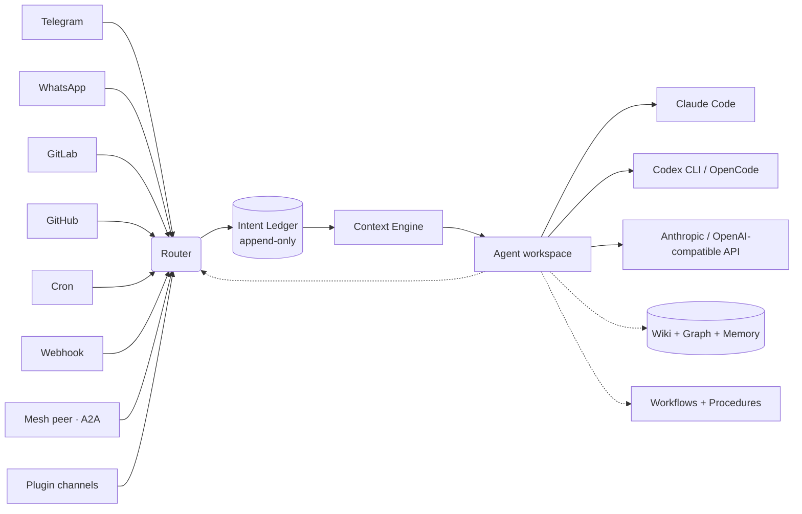

<div align="center">



# AgentX

**A self-hosted mesh of AI agents for your team — A2A-native, auditable, on your machines.**

[](https://www.npmjs.com/package/agentix-cli)
[](https://github.com/anis-marrouchi/agentx/actions/workflows/ci.yml)
[](LICENSE)
[](package.json)
[](https://github.com/a2aproject/A2A)

[Docs](https://agentx-docs.pages.dev) · [Install](#install) · [Journey (13 chapters)](#docs) · [How it compares](#how-it-compares)

<!-- HERO: replace with the "One message. Three machines." GIF once filmed -->


*Agents on different machines discover each other, delegate work, and report back — every dispatch recorded in a replayable ledger.*

</div>

---

Most agent tools give you **one agent in one chat app**. AgentX runs a **network**: agents on your laptop, your VPS, and your teammates' machines pair with one link, talk over the open [A2A protocol](https://github.com/a2aproject/A2A) (Linux Foundation), and answer on the channels your team already uses — Telegram, WhatsApp, GitLab, GitHub.

```
You (Telegram): "@cx CI is red on gitlab — fix it and ship a patch"
  cx (laptop)   → resolves @builder via the mesh directory
  builder (vps) → fixes, opens the MR, pipeline green
  cx            → replies in your Telegram thread with the MR link
```

## Try it in 60 seconds — no keys, no accounts

```bash
npx agentix-cli demo
```

Boots **three real daemons on your machine**, pairs them into a real A2A mesh, and plays a cross-node scenario — delegation, mesh hop, fix, report-back — live in the dashboards. Only the model is scripted; the daemons, mesh protocol, and ledger are the real thing.

## Install

```bash
npm install -g agentix-cli   # the npm name; the command is `agentx`
agentx setup                 # web wizard: agents, channels, keys
```

Or one line — installs the CLI and opens the wizard:

```bash
curl -fsSL https://raw.githubusercontent.com/anis-marrouchi/agentx/master/install.sh | bash
```

Docker: `git clone https://github.com/anis-marrouchi/agentx.git && cd agentx && docker compose up -d`

Then open the dashboard at **http://127.0.0.1:4202**. Pair a second machine with `agentx connect mesh` — it prints an `agentx-mesh://join/…` link; run it on the other node and you have a mesh. Full guide: [install docs](docs/install.md).

## Why a mesh

- **One agent can't be everywhere.** Your GitLab runner box, your WhatsApp-paired Mac, and your GPU server each run the agents that belong there; the mesh routes `@mentions` to whichever node owns the agent — cross-machine, cross-channel.
- **A2A-native, not proprietary.** Nodes exchange agent cards and tasks over the Agent2Agent protocol (150+ orgs behind the standard). Your mesh isn't locked to AgentX — anything that speaks A2A can join the conversation.
- **Auditable by construction.** Every dispatch decision — channel message, mesh hop, cron fire, workflow step — lands in an append-only intent ledger. `agentx ledger replay` reproduces the decision deterministically when you need to know *why* an agent did something.
- **Secure by default.** The daemon binds to loopback; mesh endpoints verify bearer tokens; agent-to-agent chains are depth-capped; credentials live in env vars and never enter prompts. Threat model: [SECURITY.md](SECURITY.md).

## What you get

- **Channels** — Telegram, WhatsApp (QR pair in the browser), GitLab, GitHub, generic webhooks. Agents reply where they were asked, or push anywhere.
- **Mesh federation** — pair nodes over Tailscale/VPN with one link; manage any peer's config from one dashboard; GitLab mentions route across nodes with peer-owned tokens.
- **Agents are folders, not code** — persona, knowledge, and tools in plain Markdown (`CLAUDE.md`, skills, references). Bring Claude Code, Codex CLI, OpenCode with any configured provider, Anthropic/OpenAI APIs, or an OpenAI-compatible endpoint.
- **Operator surface** — browser setup wizard + 11-page admin dashboard: live activity, Kanban boards synced two-way with GitLab/GitHub issues, token-cost accounting, scoped API tokens.
- **Scheduled work** — plain-English cron: `agentx schedule "every Monday at 9am" --agent sales`, with failure alerts and auto-disable.
- **Workflows & procedures** — declarative YAML state machines with a visual editor for the flows that must survive restarts; versioned SOPs agents cite at runtime; deterministic no-LLM handlers for canonical answers.
- **Compounding memory** — conversations absorb into a shared wiki (typed articles, `[[wikilinks]]`, versioned) that every agent queries — also exposed to Cursor/Claude Code via MCP (`agentx serve --stdio`).
- **Wearable agents** — `agentx attach <agent>` makes the Claude Code session you already have open answer as that agent, so a Telegram or GitLab message reaches you where you're already working instead of spawning a subprocess. Unclaimed messages fall back to a spawned agent, so it's a preference, never a dependency.
- **Governance** — intent ledger + replay, PM gating, typed capabilities, delegation-depth caps, destructive-action guardrails that hold even under `bypassPermissions`.

## How it compares

| | **AgentX** | OpenClaw | Hermes Agent | Claude Code |
|---|---|---|---|---|
| Agents per install | a mesh of many, across machines | one | one | one session |
| Cross-machine delegation | ✅ A2A protocol | ❌ | ❌ | ❌ (in-process subagents) |
| Open interop standard | ✅ A2A (Linux Foundation) | ❌ | ❌ | MCP for tools |
| Users / operators | team, multi-operator | single-user | single-user | single account |
| Audit ledger + replay | ✅ append-only, deterministic replay | ❌ | ❌ | ❌ |
| GitLab-native (boards, MRs, cross-node mentions) | ✅ | ❌ | ❌ | ❌ |
| Chat channels | 6 + webhooks + plugins | ~24 | multiple | terminal |
| LLM providers | Claude Code, Codex CLI, OpenCode, Anthropic, OpenAI-compatible | Claude-first | model-agnostic | Claude |
| Self-hosted, no telemetry | ✅ | ✅ | ✅ | n/a |

*(As of July 2026 — corrections welcome via PR.)*

> **Running solo, just for yourself?** [OpenClaw](https://github.com/openclaw/openclaw) is built for exactly that and has a lighter install. If you outgrow it, we import your config: [Migrate from OpenClaw](docs/migration/from-openclaw.md).

## Use cases

- **Solo founder ops** — run support triage, invoices, and scheduled reports from Telegram ([journey ch. 1–2](docs/journey/01-telegram-qa-bot.md))
- **Dev team** — GitLab MR review agent + WhatsApp escalation + nightly maintenance across two machines ([mesh federation](docs/journey/08-mesh-federation.md))
- **Agency / B2B** — one node per client, scoped tokens, per-agent cost accounting ([tokens](docs/reference/tokens.md), [usage](docs/playbooks/tier2-billing.md))
- **Public-facing service** — citizen/customer intake bot with an auditable trail of every decision ([BPM grant application](docs/journey/12-bpm-grant-application.md))

## Screenshots

| Live activity | Mesh | Boards |
|---|---|---|
|  |  |  |

| Admin | Intent graph | Setup wizard |
|---|---|---|
|  |  |  |

## Architecture


```mermaid
graph LR
  T[Telegram] --> R(Router)
  W[WhatsApp] --> R
  G[GitLab] --> R
  GH[GitHub] --> R
  C[Cron] --> R
  H[Webhook] --> R
  M[Mesh peer · A2A] --> R
  PL[Plugin channels] --> R
  R --> LDG[(Intent Ledger<br/>append-only)]
  LDG --> CTX[Context Engine]
  CTX --> AG[Agent workspace]
    AG --> P1[Claude Code]
    AG --> P2[Codex CLI / OpenCode]
    AG --> P3[Anthropic / OpenAI-compatible API]
  AG -.-> MEM[(Wiki + Graph + Memory)]
  AG -.-> WF[Workflows + Procedures]
  AG -.-> R
```

Each agent = a workspace directory (`CLAUDE.md`, `.claude/skills/`, hooks, MCP servers). AgentX decides when and where agents run, records every dispatch in the ledger, and lets plugins extend channels and the event bus. It's the ops layer *above* agent frameworks — if you want a DSL for a single agent, AutoGen/LangGraph/CrewAI are that; AgentX is which agent runs, on which channel, on which machine, at what cost, replayably.

## Docs

Full documentation: **[agentx-docs.pages.dev](https://agentx-docs.pages.dev)** — including the worked journey from a one-agent Telegram bot to a hardened multi-node mesh:
[Telegram Q&A bot](docs/journey/01-telegram-qa-bot.md) → [scheduled reports](docs/journey/02-scheduled-reports.md) → [multi-agent groups](docs/journey/03-multi-agent-group.md) → [cross-channel](docs/journey/04-cross-channel.md) → [hooks](docs/journey/05-hooks-webhooks.md) → [shared wiki](docs/journey/06-shared-wiki.md) → [mesh federation](docs/journey/08-mesh-federation.md) → [deterministic services](docs/journey/09-deterministic-services.md) → [MCP server](docs/journey/10-mcp-server.md) → [production hardening](docs/journey/11-production-hardening.md) → [BPM](docs/journey/12-bpm-grant-application.md) → [wearable agents](docs/journey/14-wearable-agent.md)

Reference: [CLI](docs/reference/cli.md) · [Config schema](docs/reference/config-schema.md) · [Dashboard](docs/reference/dashboard/) · [Tokens](docs/reference/tokens.md) · [Tailscale](docs/reference/tailscale-setup.md)

## Community

- **[Share your mesh](../../issues/new?template=share_your_mesh.yml)** — real-world setups shape the roadmap
- [Contributing](CONTRIBUTING.md) · [Security policy](SECURITY.md) · [Changelog](CHANGELOG.md)

If AgentX is useful to you, a ⭐ genuinely helps others find it.

## License

MIT.
