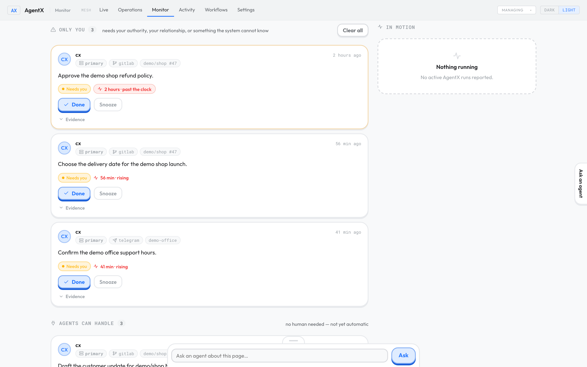
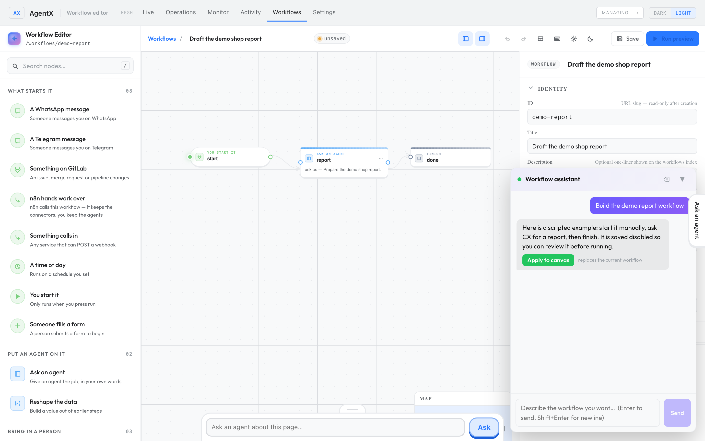

<div align="center">


# AgentX

**Put an AI teammate on the tools your team already uses.**

[](https://www.npmjs.com/package/agentix-cli)
[](https://github.com/anis-marrouchi/agentx/actions/workflows/ci.yml)
[](LICENSE)
[](package.json)

[See the demo](#see-it-without-an-account) · [Install](#install) · [Read the guide](docs/index.md)

</div>

AgentX routes messages and scheduled jobs to AI agents you host. Connect Telegram, WhatsApp, GitLab, GitHub, or a webhook. Give each agent a clear job. Watch the result in a browser dashboard.

## Current state: usable, experimental, not yet stable

AgentX works and can be used today, but it is still an **experimental project, not a stable release**. There is plenty to polish and fix, especially the **Settings experience and configuration flows**. Expect rough edges and changes as people try it in real environments.

The current source release is **0.28.0**. Our priority is to learn from actual use: what works, what breaks, and what is confusing to set up or operate.

**Still missing: role-based access control (RBAC) at both mesh and agent levels.** We want to define who can access shared nodes and agents, delegate work, and perform particular actions. This would open up more possibilities for shared teams and multi-user deployments. Existing mesh authentication and tool permissions do not provide this complete role model; RBAC is planned work, not an available feature.

[Try the demo](#see-it-without-an-account), [check the requirements](docs/requirements.md), or [help us test](#help-test-and-improve-agentx).



*The Monitor dashboard in the isolated demo: review tasks that need you, with in-page agent chat. All displayed tasks are fictional.*

## See it without an account

From a built source checkout with Node.js 22.x, run:

```sh
node dist/cli.js demo
```

The demo starts three local AgentX daemons and sends a task between them. Routing, network calls, and the event record are real. Model responses are scripted, so the demo makes no billable model calls. The terminal prints the dashboard addresses. [What to expect](docs/see-it-first.md).

## What it does

- **Answers where your team works.** Connect a channel and assign its messages to an agent.
- **Runs scheduled work.** Ask an agent for a daily report or another recurring task.
- **Shows what happened.** Live shows current work; Activity records completed runs; Monitor shows reviewed work that needs a person and work agents can handle.
- **Offers several ways to interact.** Use [in-page chat](docs/dashboard/chat.md), the [OpenCode-backed TUI](docs/dashboard/tui.md), or the desktop assistant for voice and computer use.
- **Grows across machines.** Start with one host, then pair another when a job needs its tools or files.

## Describe an automation, get an automation

The Workflows editor has a chat control. Describe the timing, source, and destination in ordinary language. An authoring agent can propose a workflow and show an **Apply to canvas** action. Read the proposed steps before applying them: this replaces the current graph. Real authoring needs a working model. The demo includes a fixed example for **Build the demo report workflow**. [Walk through it](docs/automations/describe-it.md).



## Install

A technical teammate needs a terminal for installation, model setup, and starting the services. The web wizard handles the rest of the initial setup; daily inspection is in the browser. AgentX requires **Node.js 22.x**.

```sh
git clone https://github.com/anis-marrouchi/agentx.git
cd agentx
git checkout main
cp .env.example .env
docker compose up --build -d
```

Open **http://127.0.0.1:4202/setup**. Compose builds this checkout and starts both services; its default image uses an API model rather than a preinstalled model CLI.

Without Docker, install Node 22.x and pnpm 10, then build and open the wizard:

```sh
pnpm install
pnpm build
node dist/cli.js setup
```

On a source install, the wizard serves the dashboard and **the daemon is a separate process**. Start it in another terminal, or use the wizard's **Start daemon now** button:

```sh
node dist/cli.js daemon start --detach
node dist/cli.js daemon status
```

The npm package is `agentix-cli`; the installed executable is `agentx`. **Published version 0.27.0 has an installation error:** its postinstall script is missing from the package. Version 0.28.0 includes the fix; use 0.28.0 or newer, or build from source/Docker. Follow the [installation guide](docs/install.md) for details.

## One machine is enough to start

When an agent needs to work on another machine, pair the nodes with `agentx connect mesh invite` and `agentx connect mesh join <link>`. A connected agent can pass work to another node. For example:

```text
You:     "@cx CI is red on GitLab — find the cause"
CX:      sends the build investigation to @builder on another node
Builder: checks the project and reports the result
CX:      replies in the original thread
```

The [second-machine guide](docs/jobs/second-machine.md) covers pairing. You do not need mesh for a one-agent setup.

## The dashboard

The six top-level tabs are **Live, Operations, Monitor, Activity, Workflows, and Settings**. [Dashboard guide](docs/dashboard/index.md). The dashboard and daemon must both be running for messages to be handled.

## Channels and models

Telegram and WhatsApp have pairing flows. GitLab, GitHub, and generic webhooks can bring in events. **Slack and Discord are not supported as live channel adapters in this build.** [Channel reference](docs/reference/channels.md).

Real agents need a configured model. An API provider needs a key; Claude Code, Codex CLI, and OpenCode need their CLI installed and authenticated on the host. Model-provider charges or subscription terms depend on your chosen provider.

## Help test and improve AgentX

The most valuable contribution right now is **trying AgentX and reporting what happens**. You do not need to write code to help.

1. **Test and report issues.** Try installation, Settings, model setup, chat, the desktop assistant, the TUI, or a task across nodes. Report failures and confusing steps, including what you expected and what actually happened.
2. **Help with triage and workflow/pipeline management.** Reproduce reports, identify duplicates, clarify priorities, and help follow issues through fixes, CI, and releases.
3. **Contribute code and documentation.** Fix bugs, improve setup and Settings, clarify instructions, or help design the missing mesh-level and agent-level RBAC. Discuss larger changes in an issue first.

[Report an issue](https://github.com/anis-marrouchi/agentx/issues/new) with your version, operating system, steps to reproduce, and relevant logs or screenshots. Remove secrets and private data before sharing. Report security vulnerabilities through the [security policy](SECURITY.md).

See [Contributing](CONTRIBUTING.md) for testing, issue triage, and development instructions.

## Help and development

- [Start here](docs/index.md) · [Troubleshooting](docs/help/its-not-answering.md) · [CLI reference](docs/reference/cli.md)
- [Support and supported environments](.github/SUPPORT.md) · [Ask a question](https://github.com/anis-marrouchi/agentx/discussions)
- [Contributing](CONTRIBUTING.md) · [Security policy](SECURITY.md) · [Changelog](CHANGELOG.md)

AgentX is released under the [MIT License](LICENSE).
