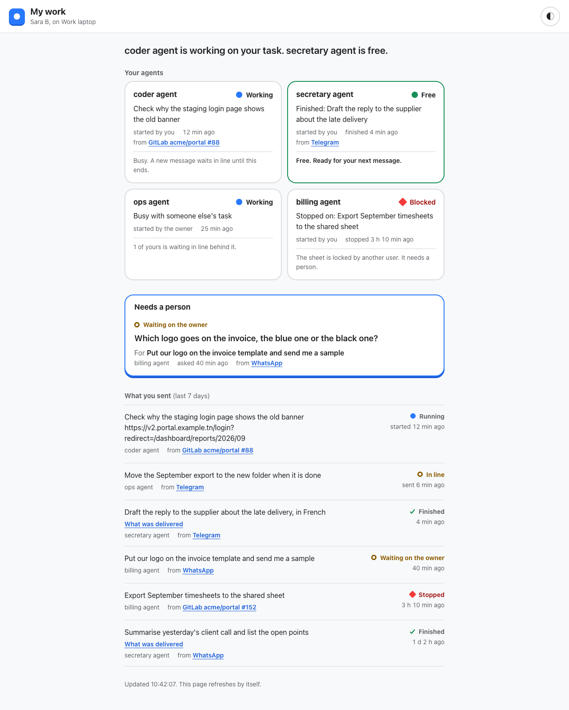
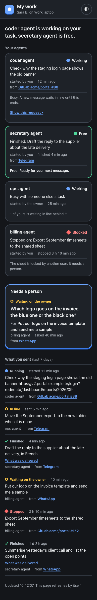
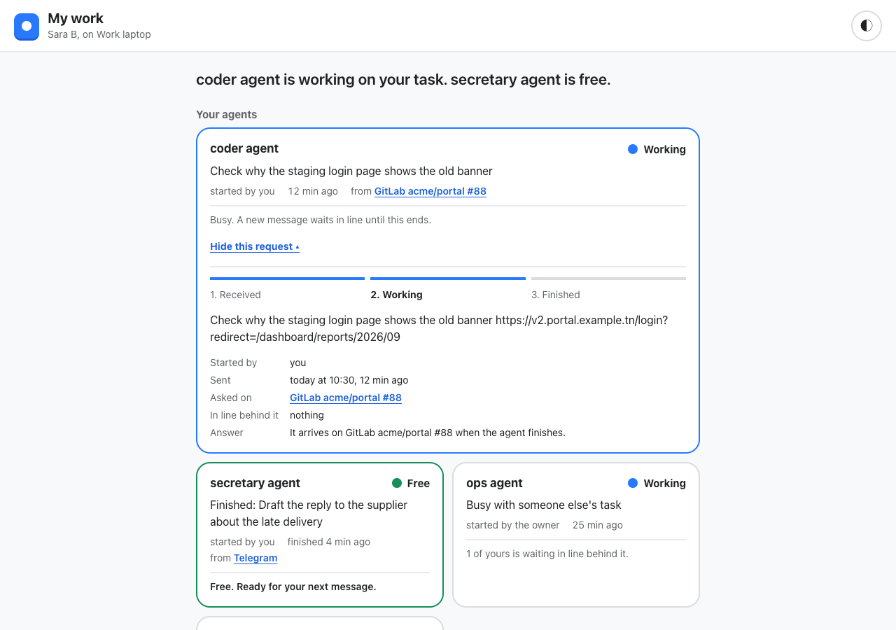
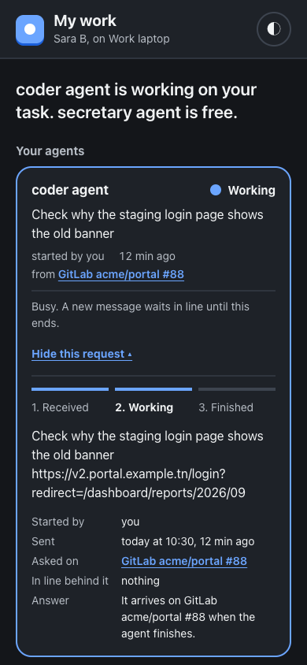
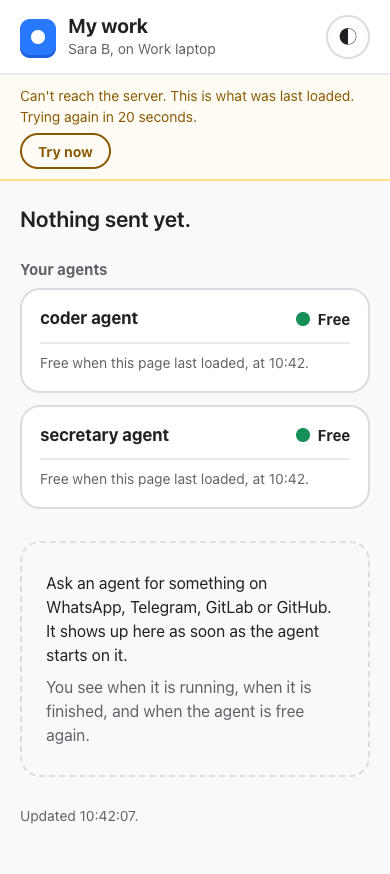
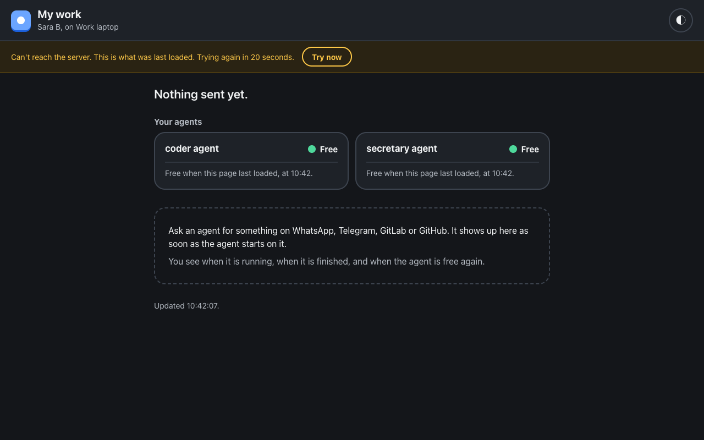

# Concept for #443: My work, pairing, waiting (version 2)

Design concept for the member page (`/member`), for the owner's approval. This branch holds pictures and one standalone page only; it has no code and is not meant to be merged.

Version 2 redraws the work page around the feedback of the first member who used it (2026-10-02). Version 1 is kept in [`v1/`](v1) for comparison. The pairing and waiting pages are unchanged.

`concept.html` is a static page with sample data, built on the real colour tokens from `src/daemon/ui/tokens.ts`. Download it and open it in a browser; add `?page=work|empty|pair|waiting`, `&theme=dark` and `&open=1`.

## My work

| Laptop, light | Phone, dark |
|---|---|
|  |  |

Also: [laptop, dark](work-dark-laptop.png) · [phone, light](work-light-phone.png)

## A card opened: the request the agent is on

| Laptop, light | Phone, dark |
|---|---|
|  |  |

Also: [phone, light](open-light-phone.png). In `concept.html`, press "Show this request" on the first card, or add `&open=1`.

A card whose agent is working on the member's own task has a "Show this request" button. It opens the card in place, with no new page: a three-step line (Received, Working, Finished), the full text of what was sent, who started it, when, where it was asked with a link, what is waiting in line behind it, and where the answer will arrive. A card that is busy with someone else's task has no button. What the agent is doing inside the task is not shown; that is the reasoning history left for a later stage.

## Nothing sent yet, and the server cannot be reached

| Phone, light | Laptop, dark |
|---|---|
|  |  |

## What changed from version 1, and which request it answers

| The member asked for | In the concept |
|---|---|
| The state of each agent at the top: free, working, blocked, each with its own colour | "Your agents" is the first block. One card per agent, with a green dot Free, a blue dot Working, a red diamond Blocked. The word is always there, so colour is never the only sign. |
| Which agent has the task, and who started that agent | Each card names the task and says "started by you" or "started by the owner". Another person's task text is not shown, only "Busy with someone else's task". |
| A clear sign when an agent has finished and is free | The card turns green-edged and says "Finished: …, 4 min ago" and "Free. Ready for your next message." The task also reads Finished in the list below. |
| To see "free" before sending the next comment | A busy card says "A new message waits in line until this ends". A message already waiting shows as "In line" in the list and as "1 of yours is waiting in line" on the card. |
| The history of how the agent reasoned | Not drawn. He said it can come later. |
| The connection error that needed a reopen | The strip says "Can't reach the server … Trying again in 20 seconds" with a "Try now" button, and agent states are marked as last loaded, not live. |
| "In progress" almost never showing | "What you sent" is one list built from the member's own turns (Running, In line, Finished, Waiting on the owner, Stopped), so every message he sends appears. It replaces Open, Finished and Latest turns. |
| Raw text with markdown marks | Task text is drawn as plain sentences. |

"Needs a person" stays as in version 1: the only blue-edged block, present only when something waits on a person.

## What this needs that the page does not receive today

Version 1 used only data the page already receives. Version 2 does not:

1. **Agent state** (free, working, blocked) for the agents the member may use.
2. **Who started the running task**, as "you", "the owner" or "someone else".
3. **Messages waiting in line** for a busy agent.
4. **The member's turns as the main list.** Today the Open and Finished lists are built from request records, which are only created for the owner's turns.

All four can be read from records the node already keeps, but the member page is not given them today. The issue's criterion "nothing new becomes reachable from the page" would have to change for points 1 to 3.

## Checked

- Contrast: 23 text and shape pairs per theme, all at or above the minimum (4.5 for text, 3 for large text and shapes). The list is in `contrast.txt`. The grey card outline is decoration and is not in the list.
- No sideways scroll at 1280, 390 and 320 wide, with a long address in a task, card closed and opened.
- The "Show this request" button is a real button with its open state announced; it works by keyboard in the static page.
- Not checked: a screen reader, a real phone, Windows, the member's own opinion of this version. The blue square in the top bar stands in for the app icon.
