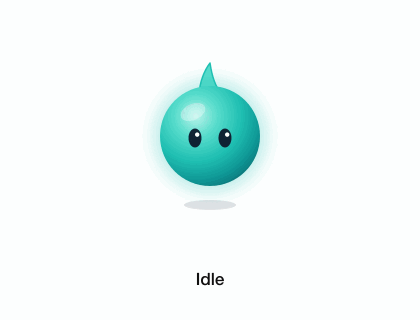
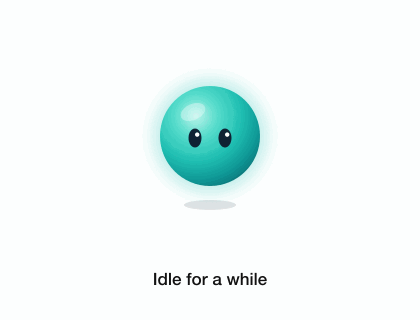
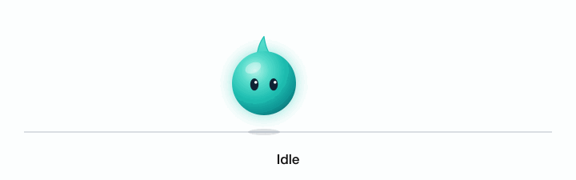
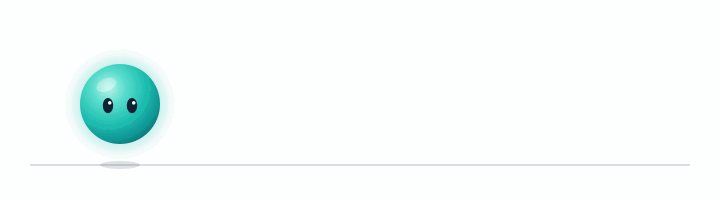
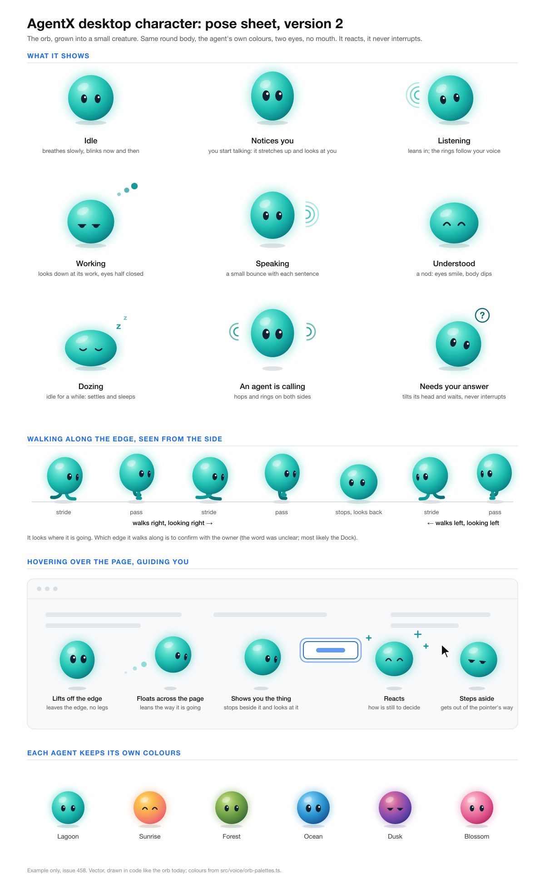

# Desktop character concept (issue #458)

Pose sheet, version 3, and five moving previews. Not meant to be merged.

- The character has no legs: its walk is the hovering (owner, 2026-10-02).
- Nothing is a still picture: every state, every mark around it and every
  change between two states is animated (owner, 2026-10-02).

A state is a small set of numbers (stretch, lean, height, gaze, eyes, how
strong each mark is), so going from any state to any other is a blend of
those numbers with easing (`anim.py`). Trail dots, stars, rings, thinking
dots and the sleep letters are small particles with a short life of their own.

| | |
|---|---|
| From state to state  | Falling asleep and waking  |

A reaction, with its stars and its trail:

Along the edge:

Over a page, showing you a button:

Rebuild (needs `rsvg-convert` and `magick`):

    python3 build_sheet.py && rsvg-convert character-sheet.svg -o character-sheet.png
    python3 build_anim.py

`*-frames.png` show every fifth frame. `build_anim.py` also prints, for each
preview, the biggest change between two frames next to the typical one, and
the change across the loop: a pose that snapped would stand out there.
