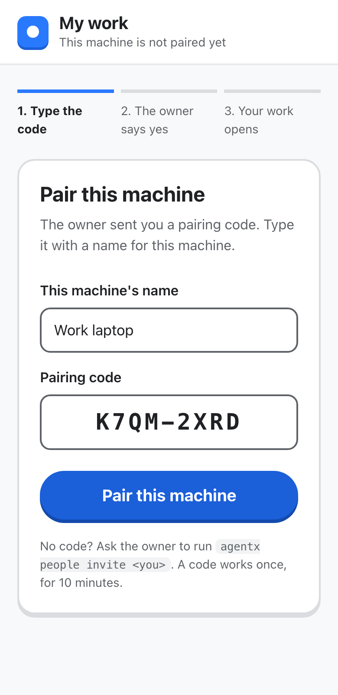
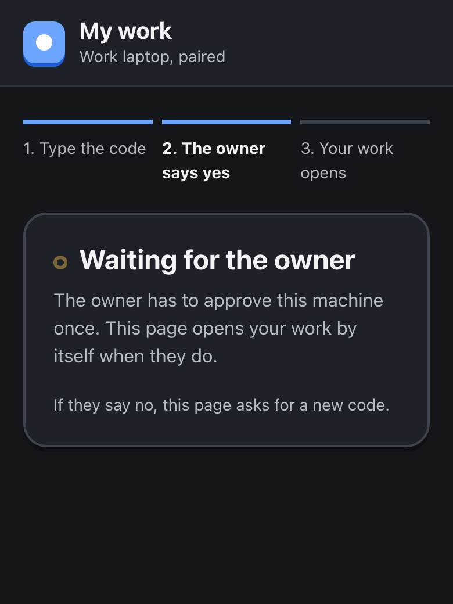

# Concept for #443: My work, pairing, waiting

Design concept for the member page (`/member`), for the owner's approval. This branch holds pictures and one standalone page only; it has no code and is not meant to be merged.

`concept.html` is a static page with sample data, built on the real colour tokens from `src/daemon/ui/tokens.ts`. Download it and open it in a browser; add `?page=work|empty|pair|waiting` and `&theme=dark`.

## My work

| Laptop, light | Phone, dark |
|---|---|
|  |  |

Also: [laptop, dark](work-dark-laptop.png) · [phone, light](work-light-phone.png) · [nothing open, offline](empty-light-phone.png)

## Pairing and waiting

| Pair this machine | Waiting for the owner |
|---|---|
|  |  |

Also: [pairing, laptop](pair-light-laptop.png) · [pairing, phone, dark](pair-dark-phone.png) · [waiting, laptop](waiting-light-laptop.png)

## What it proposes

1. One sentence at the top says where things stand.
2. "Needs a person" is the only boxed, blue-edged block. It holds requests waiting on the owner, led by the question the owner was asked, and stuck requests, led by the reason. It is absent when there are none.
3. Everything else is a quiet ruled list: what was asked, the agent, where it was asked, the state, and when it last moved.
4. State is a shape and a word, never colour alone: blue dot In progress, ring Waiting, red diamond Stuck, tick Done, dash Dropped or Declined.
5. "Latest turns" stays a list at the bottom, as on the page today.
6. Pairing and waiting share the top bar and a three-step line (Type the code, The owner says yes, Your work opens).

## Checked

- Contrast: 19 text and shape pairs per theme, all at or above the minimum (4.5 for text, 3 for large text and shapes). The list is in `contrast.txt`.
- No sideways scroll at 1280, 390 and 320 wide, with a long address in a request.
- Every value shown is already in `/api/member/me` and `/api/member/work`.
- Not checked: a screen reader, a real phone, Windows. The blue square in the top bar stands in for the app icon.
