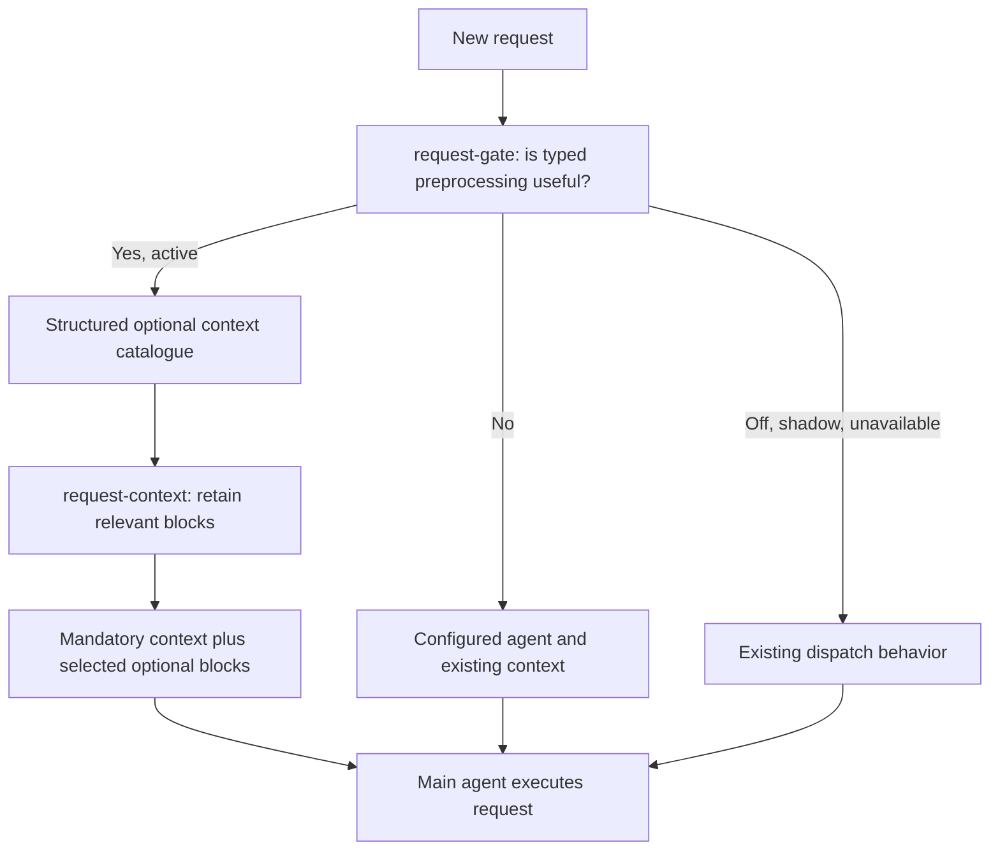

# Jev: small decisions inside a larger task

Before enabling a backend, check [computer-use credentials and requirements](../requirements.md#computer-use).

In AgentX, Jev is an optional backend for typed decisions. The integration gives it structured state and explicit questions, then receives answers used by the calling code. The agent's main model still handles open-ended reasoning and writing.

## Start with one example: point at a control

When you run `agentx point "the search field"`:

1. The native helper reads the active application's accessibility tree.
2. If the tree is too sparse, local OCR supplies readable text and its position.
3. AgentX creates a bounded list of candidate controls.
4. The `ui-element` decision seat asks whether the requested control is present, and which candidate matches it.
5. The caller checks the answer and maps the chosen ID to coordinates before drawing a highlight.

A candidate-selection question always has a choice to return. The separate “is it present?” question lets AgentX refuse to highlight an unrelated control.

## What is a decision seat?

A *seat* is a named decision point in the application. Each has its own inputs, questions, and caller behavior.

| Seat | Question it helps answer |
|---|---|
| `ui-element` | Which visible control matches this request? |
| `screen-state` | Does the gathered evidence settle the claim, and does the claim hold? |
| `wiki-rerank` | Which candidate articles are relevant? |
| `voice-narration` | Which predefined spoken phrase fits this event? |
| `presence-mode` | On this voice turn, should the agent talk, act, teach, watch or stay quiet on screen; stay on screen after; and what first? |
| `guard-risk` | Does an action need additional scrutiny? |

The decision API uses typed questions, including categorical choices and yes/no probabilities. Probability estimates are not proof of correctness. Calibration and evaluation require labeled outcomes for the actual seat.

## Enable observation before changing behavior

Decisions are disabled by default. Each seat supports `off`, `shadow`, and `active`. Shadow mode records decisions while keeping the existing behavior authoritative.

Merge this example into your configuration; it is not a complete `agentx.json`:

```json
{
  "decisions": {
    "enabled": true,
    "defaultBackend": "jev",
    "seats": {
      "ui-element": { "mode": "shadow" }
    }
  }
}
```

The current code's `jev` adapter uses OpenRouter's decisions endpoint and reads `OPENROUTER_API_KEY`. The `typesafe` adapter reads `TYPESAFE_API_KEY` for the direct endpoint. These are backend defaults in this checkout, not a guarantee of external service availability. The local and `simple-jev` adapters are separate alternatives.

Inspect the recorded behavior before moving a seat to active:

```sh
agentx decisions backends
agentx decisions stats --since 1d
agentx decisions calls --help
agentx decisions calibrate --help
agentx decisions recalibrate --help
```

## How computer-use verification differs

`look` sends captured pixels to a vision model for an observation. Jev receives the structured observation and other evidence through `screen-state`; it does not directly inspect those pixels in this integration.

Verification distinguishes **confirmed**, **refuted**, and **unknown**. A tiny recording indicator may not be legible enough to settle a claim. System probes or checking the resulting media file can provide stronger evidence.

`askSeat` returns no decision if a backend fails or a seat is unavailable, leaving the caller to choose a fallback. The screen verifier uses the vision model's reading as an explicitly uncalibrated fallback; an unclear reading remains unknown. Do not assume every caller handles failures identically.

See [the recording case](../tutorials/record-vscode.md) and the [command reference](../reference/cli.md#computer-use-and-teaching).

## Request intake and context selection



The gate is itself a bounded typed decision. It does not answer arbitrary requests or execute tools. It receives a clipped request, the source channel, agent identity, and the available preprocessing operations. An active negative answer bypasses optional context planning and model routing.

Optional context is a catalogue of stable IDs with source, description, size, bounded preview, and a data-trust label. The context seat can omit clearly irrelevant mesh overviews, patterns, references, memory, other-chat summaries, older recall, or wiki blocks. Uncertain, missing, shadow, and failed selection results retain context. The original request, identity, permissions, runbooks, skills, attachments, same-chat continuity, and handover remain outside its removal allowlist.

This selects AgentX-assembled context before rendering the prompt. It does not erase native CLI session history, filter files/tools the main agent later reads, or avoid retrieval already performed upstream. Context previews are sent to the configured decision backend; this is not a data-isolation boundary.

Enable both seats using the backend you have configured (this example uses the existing direct `typesafe` adapter):

```json
{
  "decisions": {
    "enabled": true,
    "seats": {
      "request-gate": { "mode": "active", "backend": "typesafe", "timeoutMs": 3000 },
      "request-context": { "mode": "active", "backend": "typesafe", "timeoutMs": 3000 }
    }
  }
}
```

An active gate replaces the legacy Haiku context-planner call. When the gate is off/shadow/unavailable, existing non-desktop dispatch remains authoritative. Each new decision has a three-second timeout.

### Desktop model guarantee

Desktop requests arriving through `/ask` use the `voice` channel. Both `voice` and `desktop` requests are excluded from automatic cheap-model routing, even for greetings, short confirmations, and cold sessions. They also skip the legacy Haiku context planner. Jev may still perform typed context decisions; the main response and computer-use task stay on the assigned agent's configured model. This preserves that configured model rather than selecting a hard-coded premium model; provider failures do not authorize a downgrade.
