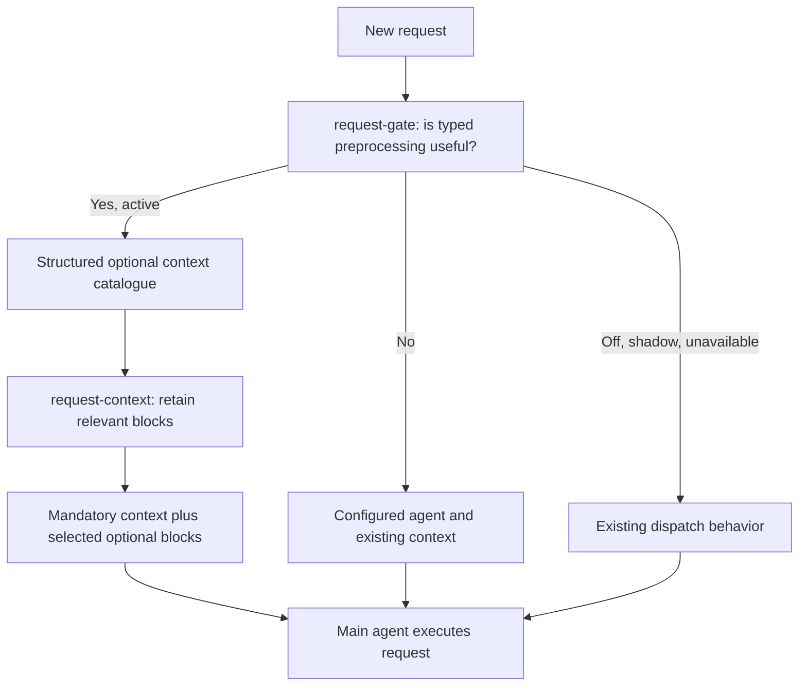

# Jev: small decisions inside a larger task

Before enabling a backend, check [computer-use credentials and requirements](../requirements.md#computer-use).

In AgentX, Jev is an optional backend for typed decisions: small questions with a fixed set of possible answers ("which of these controls?", "yes or no?") that a fast model answers in a fraction of a second. The integration gives it structured state and explicit questions, then receives answers used by the calling code. The agent's main model still handles open-ended reasoning and writing.

## Start with one example: point at a control

When you run `agentx point "the search field"`:

1. The native helper reads the active application's accessibility tree (the list of buttons, fields and labels that macOS exposes for screen readers).
2. If the tree is too sparse, local OCR (reading text from the screen image) supplies readable text and its position.
3. AgentX creates a bounded list of candidate controls.
4. The `ui-element` decision seat asks whether the requested control is present, and which candidate matches it.
5. The caller checks the answer and maps the chosen ID to coordinates before drawing a highlight.

A candidate-selection question always has a choice to return. The separate “is it present?” question lets AgentX refuse to highlight an unrelated control.

## What is a decision seat?

A *seat* is a named decision point in the application. Each has its own inputs, questions, and caller behavior.

| Seat | Question it helps answer |
|---|---|
| `ui-element` | Which visible control matches this request? |
| `screen-state` | Does the gathered evidence settle the claim, and does the claim hold? |
| `wiki-rerank` | Which candidate articles are relevant? |
| `voice-narration` | Which predefined spoken phrase fits this event? |
| `presence-mode` | On this voice turn, should the agent talk, act, teach, watch or stay quiet on screen; stay on screen after; and what first? |
| `guard-risk` | Does an action need additional scrutiny? |
| `request-gate` | Would this new request benefit from Jev preprocessing? |
| `request-context` | Which optional pieces of context should this request receive? |
| `session-continuity` | Does this turn need the earlier conversation, or can the session start fresh early? |
| `intent-path` | Which intent-graph category, then which verb within it, does this message belong to? Replaces the model call the classifier makes on a cache miss. |
| `task-tier` | Does this task need the strongest model, or would a cheaper one do? Steers model routing when `active` and `decisions.routing` names a cheap model. |
| `wake-gate` | Does this event need an agent run at all? Not yet asked on the live path; replayed on recorded runs by the [backtest](./jev-backtest.md). |

More seats exist in `src/decisions/seats/`; the table lists the ones this page refers to.

The decision API uses typed questions, including categorical choices and yes/no probabilities. Probability estimates are not proof of correctness. Calibration and evaluation require labeled outcomes for the actual seat.

## Enable observation before changing behavior

Decisions are disabled by default. Each seat supports `off`, `shadow`, and `active`. Shadow mode records decisions while keeping the existing behavior authoritative.

Turn a seat on in three stages: watch it, check it, then let it act.

1. Put the backend's key in the `.env` file next to `agentx.json`. The `jev` adapter reads `OPENROUTER_API_KEY` (it uses OpenRouter's decisions endpoint); the `typesafe` adapter reads `TYPESAFE_API_KEY` for the direct endpoint. These are the backend defaults in this code, not a promise that the external service is available. The local and `simple-jev` adapters are separate alternatives.
2. Add the seat in shadow mode. Merge this into your `agentx.json`; it isn't a complete file:
   ```json
   {
     "decisions": {
       "enabled": true,
       "defaultBackend": "jev",
       "seats": {
         "ui-element": { "mode": "shadow" }
       }
     }
   }
   ```
3. **Terminal:** restart the daemon so it reads the change:
   ```sh
   agentx daemon stop
   agentx daemon start --detach
   ```
4. Use the feature for a while (for `ui-element`, run `agentx point` a few times).
5. **Terminal:** check that the backend answers:
   ```sh
   agentx decisions backends
   ```
6. **Terminal:** read the recorded calls, failures and latency for the last day:
   ```sh
   agentx decisions stats --since 1d
   ```
7. When the answers look right, change `"mode": "shadow"` to `"mode": "active"`.
8. **Terminal:** restart the daemon again.

For deeper inspection and calibration, see:

```sh
agentx decisions calls --help
agentx decisions calibrate --help
agentx decisions recalibrate --help
```

## How computer-use verification differs

`look` sends captured pixels to a vision model for an observation. Jev receives the structured observation and other evidence through `screen-state`; it does not directly inspect those pixels in this integration.

Verification distinguishes **confirmed**, **refuted**, and **unknown**. A tiny recording indicator may not be legible enough to settle a claim. System probes or checking the resulting media file can provide stronger evidence.

`askSeat` returns no decision if a backend fails or a seat is unavailable, leaving the caller to choose a fallback. The screen verifier uses the vision model's reading as an explicitly uncalibrated fallback; an unclear reading remains unknown. Do not assume every caller handles failures identically.

See [the recording case](../tutorials/record-vscode.md) and the [command reference](../reference/cli.md#computer-use-and-teaching).

## Request intake and context selection


```mermaid
flowchart TD
  A[New request] --> B[request-gate: is typed preprocessing useful?]
  B -->|Yes, active| C[Structured optional context catalogue]
  C --> D[request-context: retain relevant blocks]
  B -->|No| E[Configured agent and existing context]
  B -->|Off, shadow, unavailable| F[Existing dispatch behavior]
  D --> G[Mandatory context plus selected optional blocks]
  G --> H[Main agent executes request]
  E --> H
  F --> H
```

The gate is itself a bounded typed decision. It does not answer arbitrary requests or execute tools. It receives a clipped request, the source channel, agent identity, and the available preprocessing operations. An active negative answer bypasses optional context planning and model routing.

Optional context is a catalogue of stable IDs with source, description, size, bounded preview, and a data-trust label. The context seat can omit clearly irrelevant patterns, references, memory, other-chat summaries, older recall, or wiki blocks. It decides the landscape (the block that tells an agent about the rest of the node) one section at a time: the directory of other agents and channels, how to message another channel, how to look up earlier turns, background monitoring, and agent teams. Uncertain, missing, shadow, and failed selection results retain context. The original request, identity, permissions, runbooks, skills, attachments, same-chat continuity, handover, and the landscape's group-chat rules (for example, stay silent when another agent was mentioned) remain outside its removal allowlist.

The seat waits at most three seconds per turn. The local backend (Claude Code with Haiku) takes about 13 seconds per decision, so with it the seat always times out and keeps everything; use a faster backend such as `jev`. Measured on 16 labelled messages, the seat removed about half of the landscape with no needed section dropped: see `bench/results/jev-and-edit-followups.md` in the source code.

This selects AgentX-assembled context before rendering the prompt. It does not erase native CLI session history, filter files/tools the main agent later reads, or avoid retrieval already performed upstream. Context previews are sent to the configured decision backend; this is not a data-isolation boundary.

Enable both seats using the backend you have configured (this example uses the existing direct `typesafe` adapter):

```json
{
  "decisions": {
    "enabled": true,
    "seats": {
      "request-gate": { "mode": "active", "backend": "typesafe", "timeoutMs": 3000 },
      "request-context": { "mode": "active", "backend": "typesafe", "timeoutMs": 3000 }
    }
  }
}
```

An active gate replaces the legacy Haiku context-planner call. When the gate is off/shadow/unavailable, existing non-desktop dispatch remains authoritative. Each new decision has a three-second timeout.

### Desktop model guarantee

Desktop requests arriving through `/ask` use the `voice` channel. Both `voice` and `desktop` requests are excluded from automatic cheap-model routing, even for greetings, short confirmations, and cold sessions. They also skip the legacy Haiku context planner. Jev may still perform typed context decisions; the main response and computer-use task stay on the assigned agent's configured model. This preserves that configured model rather than selecting a hard-coded premium model; provider failures do not authorize a downgrade.

## Check it worked

1. **Terminal:** run `agentx decisions stats --since 1d`.
2. Your seat appears with its mode (`shadow` or `active`), a call count above zero, and few or no failed calls.

## If something is wrong

- **The seat doesn't appear in `decisions stats`:** check that `decisions.enabled` is `true`, that the seat's name is spelled exactly as in the table, that the daemon was restarted, and that the feature that uses the seat actually ran.
- **Every call fails:** run `agentx decisions backends`. A missing or wrong `OPENROUTER_API_KEY` or `TYPESAFE_API_KEY` is the usual cause.
- **Behavior changed in a way you didn't want:** set the seat back to `shadow` or `off` and restart the daemon. In shadow mode the existing behavior is authoritative again.
