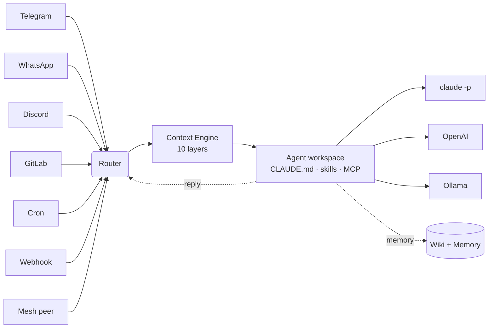

# Concepts

AgentX is **infrastructure for AI agents** — closer to systemd than to another Python framework. If you already understand cron, message queues, and HTTP webhooks, you already understand most of AgentX.

## The six primitives



### 1. Agent

A directory. That's it. It holds a `CLAUDE.md` (instructions), optional `SOUL.md`/`IDENTITY.md` (personality), skills, MCP servers, hooks. AgentX decides *when and where* the agent runs. You decide *what* it knows.

```
agents/support/
├── CLAUDE.md             # system prompt
├── SOUL.md               # persistent personality (optional)
├── skills/               # markdown-defined capabilities
├── .claude/              # Claude Code settings, permissions
└── .mcp.json             # MCP servers
```

Three execution tiers:

| Tier | Runs via | When |
|---|---|---|
| `claude-code` | spawns `claude -p ...` | You want full Claude Code (tools, skills, MCP). Uses your subscription. |
| `sdk` | Claude Agent SDK | You want programmatic control with an API key. |
| `orchestrator` | AgentX's own loop | You want any LLM (OpenAI, Ollama, Mistral…). |

### 2. Channel

The thing messages come in on. One message-in, one reply-out, or a proactive push via `/send`.

| Channel | Inbound | Outbound |
|---|---|---|
| Telegram | DM + group mention | streaming edits, typing indicators |
| WhatsApp | contact / group route | text, human-paced chunks |
| Discord | DM + mention | text |
| GitLab | webhook on MR/issue comment | comments via per-agent token |
| Webhook | `POST /webhook/:agent[/:source]` | — |
| HTTP | `POST /send`, `POST /task` | JSON |

The **router** ([`src/channels/router.ts`](https://github.com/anis-marrouchi/agentx/blob/master/src/channels/router.ts)) resolves `@mentions`, dispatches to the right agent, and streams the response back. **Block streaming** chunks long replies into human-readable pieces per channel (60 chars Telegram, 40 chars WhatsApp).

### 3. Cron

Scheduled prompts with:

- 5-field cron + timezone
- Exponential backoff retries (30s, 1m, 5m, 15m, 60m)
- Missed-run catch-up on startup
- `onError`: any combination of `log`, `notify`, `disable`
- `notify`: push failures to any channel

See [Journey 2](/journey/02-scheduled-reports) for the full pattern.

### 4. Mesh

Two machines, one agent roster. Peers publish an `/.well-known/agent-card.json`; the router can forward a task to a remote agent over HTTP (Tailscale/VPN recommended). Wikis sync across peers.

See [Journey 8](/journey/08-mesh-federation).

### 5. Wiki

A Karpathy-inspired flat wiki with per-article permissions — `public`, `shared`, `private`. Each agent has its own wiki; raw conversation entries are persisted to `.agentx/wiki/raw/entries/` continuously. Existing articles are retrieved via BM25 + tag overlap and injected into the agent's next turn.

- **Ingest** — export recent conversations as raw entries *(cheap)*
- **Query** — BM25 search, articles injected into the agent's next turn
- **Sync** — pull raw entries from mesh peers
- **Absorb** — **deprecated.** Batched LLM compile of raw entries into articles. Expensive and rarely retrieved in practice — see the [honest review](/blog/wiki-karpathy-review). Gated behind `--force`; a focused **procedure-delta** replacement tied to the intent knowledge graph is planned.

### 6. Business layer

A day-cycle ticker that fires standup/work-tick/wrap prompts at configured times, feeds tasks from a work pool (`.agentx/backlog.md`, GitLab, …), tracks KPIs per agent, and generates daily summaries. Turns a group of agents into a team with a schedule and a P&L.

See [Journey 7](/journey/07-business-layer).

## The 10-layer context engine

Every turn the agent sees is a token-budgeted compound prompt:

| # | Layer | Budget | Source |
|---|---|---:|---|
| 1 | Channel | 200 | formatting rules for this channel |
| 2 | Scope | 200 | group/project context |
| 3 | Landscape | 800 | roster of other agents + mesh peers |
| 4 | Identity | 200 | system prompt |
| 5 | Bootstrap | 500 | `SOUL.md`, `IDENTITY.md`, `USER.md`, `AGENTS.md` |
| 6 | Intent | 200 | deploy / review / bugfix detection |
| 7 | Artifacts | 500 | media, mentions |
| 8 | Memory | 600 | cross-session facts (Haiku-extracted) |
| 9 | History | 1200 | conversation |
| 10 | Wiki | 1000 | tag-matched articles |

Total: ~6000 tokens. **Compaction** kicks in when history exceeds the budget — older turns are summarized, last 6 messages kept verbatim, tool calls preserved intact.

## Queueing modes

When a message lands while the agent is already working:

- `collect` (default) — batch queued messages, deliver when the agent finishes
- `followup` — treat each queued message as a separate turn
- `drop` — discard under load

## Observability

- `agentx daemon watch` — color-coded live activity
- `curl -N http://localhost:19900/events` — raw SSE stream
- `agentx daemon logs -f` — daemon log tail
- `agentx usage today` / `agentx usage serve` — token + cost dashboard
- `AGENTX_DEBUG=webhook,cron,mesh` — verbose categories (`agent`, `channel`, `cron`, `mesh`, `context`, `memory`, `webhook`, `config`, `all`)

## Hot-reload

Every CLI change that mutates `agentx.json` validates against the Zod schema first, then signals `POST /reload` to the running daemon. Cron jobs hot-swap in place; `agents`, `channels`, `mesh`, `providers`, `node`, and `services` sections still need a restart — the daemon prints `[reload] restart required to apply changes in: …` so you know.

The daemon also watches `agentx.json` directly via `fs.watch`, so external edits (or a `git pull`) trigger the same path without a restart. Opt out with `AGENTX_AUTO_RELOAD=false` if you prefer explicit restarts.

## Further reading

- [Communication matrix](/reference/communication-matrix) — every path H2A / A2H / A2A / cross-channel / cross-mesh
- [Config schema](/reference/config-schema) — every field in `agentx.json`
- [CLI reference](/reference/cli) — every command and flag
