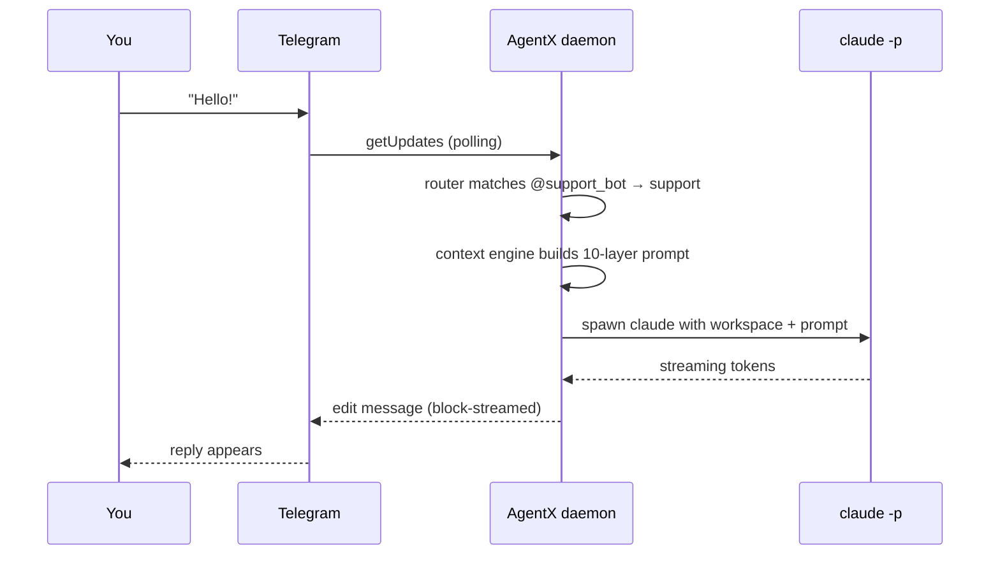

# 1. Telegram Q&A bot

> **Difficulty:** beginner · **Time:** 5 minutes · **Ends at:** a bot that replies to Telegram DMs using Claude

## Scenario

A small team wants a Telegram bot that answers technical questions and can read files from a shared project directory. No custom code — just configuration.

## Prerequisites

- AgentX installed — see [install](/install)
- Claude Code CLI authenticated (`claude --version`)
- A Telegram bot token from [@BotFather](https://t.me/BotFather)

## Commands

Every step below is a CLI verb — no file editing.

```bash
agentx init
agentx agent add       # interactive: id, workspace, model, mentions
agentx channel add     # interactive: pick Telegram, paste token from BotFather
agentx daemon start
agentx daemon watch    # color-coded activity in another terminal
```

Give the agent its personality in `agents/support/CLAUDE.md` (created by `agent add`):

```markdown
# Support

You are a concise technical assistant. Answer in 2–4 sentences unless the user asks for depth. Prefer code examples over prose.
```

## What just got written

For reference — the wizards produced this in `agentx.json`:

```json
{
  "agents": {
    "support": {
      "name": "Support",
      "workspace": "./agents/support",
      "tier": "claude-code",
      "model": "claude-sonnet-4-6",
      "mentions": ["@support_bot", "@support"]
    }
  },
  "channels": {
    "telegram": {
      "enabled": true,
      "accounts": {
        "default": {
          "token": "${TG_SUPPORT_BOT_TOKEN}",
          "agentBinding": "support"
        }
      },
      "policy": { "dm": "pair", "group": "mention-required" }
    }
  }
}
```

The bot token lives in `.env` under `TG_SUPPORT_BOT_TOKEN` (the `channel add` wizard stores it for you via the secret-preserving dotenv writer).

### Tweak later without re-running the wizards

```bash
agentx config set agents.support.model claude-haiku-4-5
agentx config set agents.support.mentions '["@support_bot","@support","@help"]'
agentx config set channels.telegram.policy.group all
```

All three hot-reload the daemon on the spot.

## Verify

1. DM your bot on Telegram: `Hello!`
2. In `agentx daemon watch` you should see:
   ```
   → Routing [telegram/You] -> "Support": Hello!
   ▶ [support] executing task (1/1)
   ✓ [support] completed in 2431ms
   ```
3. A reply arrives in Telegram within a couple of seconds, streamed as it's generated.

### In a group chat

Add the bot to a Telegram group (bot must have "read all messages" disabled by default; BotFather → group privacy off if you want the bot to read non-mention messages). With `group: "mention-required"` the bot only answers when explicitly mentioned:

```
@support_bot what's our deploy command?
```

### Turn off privacy mode (optional)

If the bot should read every message in the group (not just mentions), DM `@BotFather` → **/mybots** → your bot → **Bot Settings** → **Group Privacy** → **Turn off**.

## What just happened



## Troubleshooting

- **Bot doesn't respond** → `agentx daemon status` (running?), `agentx daemon watch` (see the failing step)
- **`Conflict: terminated by other getUpdates request`** → another process is polling the same token. Kill duplicates or revoke+reissue the token.
- **`claude: command not found`** → install Claude Code CLI and authenticate before starting the daemon.

## What's next

- **Schedule work for this agent** → [Journey 2 — Scheduled reports](/journey/02-scheduled-reports)
- **Add more agents to the same group** → [Journey 3 — Multi-agent group](/journey/03-multi-agent-group)
- **All CLI flags** → [Reference — CLI](/reference/cli)
