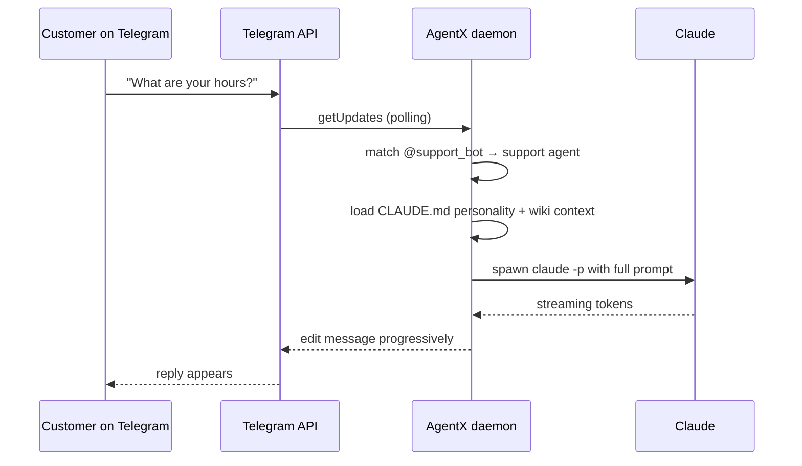

# 1. Your first agent on Telegram

> **Time:** 10 minutes · **Ends at:** a Telegram bot that answers your customers using Claude, configured entirely from the browser.

## Scenario

You run a small business. Customers DM your team on Telegram with the same five questions — opening hours, pricing, how to book. You want an AI assistant to take the first pass so your team only handles the interesting ones. No code, no config files.

## What you'll do

1. Install AgentX — the dashboard opens automatically.
2. Add one agent using the **Settings → Agents** form.
3. Give it a personality in one sentence.
4. Connect your Telegram bot via **Settings → Channels**.
5. DM the bot and watch it reply on the **Live** screen.

Every step is a button in the browser. The CLI equivalents are at the bottom in case you prefer the terminal.

---

## Step 1 — Install

```bash
curl -fsSL https://raw.githubusercontent.com/anis-marrouchi/agentx/master/install.sh | bash
```

The installer checks Node 20+, installs the CLI globally, starts the daemon, and **opens your browser at `http://127.0.0.1:4202/setup`**. You land on the setup wizard.


The wizard already has reasonable defaults. Name the team (it's only a label), accept the sample agent, click through. You're on the dashboard.

::: tip Skip the wizard
If the wizard already ran once, the topbar will offer **"Skip — open dashboard"** at the top right. Pick that; you can add agents from the dashboard any time.
:::

---

## Step 2 — Add an agent

Click **Settings → Agents** in the top bar. You'll see any agents that already exist, plus an **Add a new agent** form at the bottom.


Fill in three things:

| Field | What it means | Example |
|---|---|---|
| **Agent ID** | A short lowercase label. Can't be changed later. | `support` |
| **Agent name** | The display name (shown on cards). | `Support Bot` |
| **Trigger words** | How people mention this agent in group chats. | `@support_bot, support` |

Leave the rest on defaults (Claude Code engine, Sonnet model). Click **Add agent**. The card for your new agent appears above the form.

::: details CLI equivalent
```bash
agentx agent add    # interactive prompts — same fields as the form
```
:::

---

## Step 3 — Give it a personality

Click **Manage** on your new agent's card. This opens `CLAUDE.md` — a plain-English file that tells the agent who it is. Write 2–4 lines:

```markdown
# Support Bot

You answer questions for customers of Sundial Café.
You know our menu, hours (8am–6pm daily), and booking policy (at least 2 hours ahead, minimum 4 people for group reservations).
Keep replies under 3 sentences. If you don't know, say so and offer to pass the message to the team.
```

Save. The agent is ready.

::: tip How agents "know" things
The personality file is the system prompt — whatever you put here, the agent treats as rules. For anything longer (menu items, a price list, FAQs), drop a `.md` file alongside `CLAUDE.md` in the agent's folder. The agent reads it on demand.
:::

---

## Step 4 — Connect Telegram

Click **Settings → Channels**. Pick **Telegram** in the left rail.


You'll need a **bot token** — a 50-character string that Telegram gives you when you create a bot. If you've never done this, it takes 30 seconds and is walkthrough-level easy:

::: tip Never set up a Telegram bot before?
[**Telegram bots without the jargon** →](/reference/telegram-setup) — a pictured 30-second walkthrough of @BotFather.
:::

Fill in the **Add a Telegram account** form:

| Field | Value |
|---|---|
| **Account ID** | Free label, e.g. `support` |
| **Bind to agent** | Pick the agent you just created |
| **Bot username** | Your bot's handle (e.g. `@support_bot`) — optional, used for mention matching |
| **Bot token env-var** | A name like `TG_SUPPORT_BOT_TOKEN`. AgentX stores the actual token in `.env`, not in the config file |

Click **Add account**. Paste the token when prompted. Done.

::: details CLI equivalent
```bash
agentx channel add    # pick Telegram, paste token, choose agent
```
:::

---

## Step 5 — Watch it work

Click **Live** in the top bar.


You see one card per agent. Each shows:

- **Status** (idle / handling / offline)
- **Today's counts** — tasks handled, failed, currently running
- **24h sparkline** — tasks over time
- **Last reply preview** — what the agent just said

Now DM your bot on Telegram: *"What are your hours?"*

Watch the card: status flips to **handling**, the counter ticks up, and within seconds your Telegram chat shows the reply. That's the whole loop.

---

## Step 6 — Try the Boards view

Click **Boards**. This is the Kanban over your work pool (GitLab issues, GitHub issues, or a local `backlog.md`). It's empty until you connect a source — covered in [Journey 7](/journey/07-business-layer) — but worth knowing it's here.


---

## What you just set up



The dashboard isn't a frontend onto the CLI — it **is** the control plane. Agents, channels, crons, webhooks, mesh peers, tokens are all managed the same way: browser form → save → daemon hot-reloads.

---

## If something goes wrong

| Symptom | Where to look |
|---|---|
| **No reply in Telegram** | Live screen — is the card status "handling" or stuck "idle"? If stuck idle, the bot token may be wrong. |
| **Card says `errored`** | Click the agent card → see the last summary line + click **history** for full trace. |
| **`Conflict: terminated by other getUpdates request`** | Another process is polling the same bot token. Stop the other instance or revoke+reissue the token in @BotFather. |
| **Dashboard won't load** | `agentx daemon status` in a terminal. If nothing, `agentx daemon start`. |

Full self-diagnosis:

```bash
agentx doctor
```

## What's next

- **Make it speak WhatsApp too** → [Journey 4 — Cross-channel](/journey/04-cross-channel)
- **Have it send you a daily summary** → [Journey 2 — Scheduled reports](/journey/02-scheduled-reports)
- **Add a second agent for sales** → [Journey 3 — Multi-agent group](/journey/03-multi-agent-group)
- **Understand the seven primitives** → [Concepts](/concepts)

## All-CLI version

For operators who prefer the terminal, the same Journey in six commands:

```bash
agentx init                                         # scaffold agentx.json + .env + .agentx/
agentx agent add                                    # interactive: ID, name, trigger words, model
agentx channel add                                  # pick Telegram, paste token, bind agent
echo "TG_SUPPORT_BOT_TOKEN=<token>" >> .env         # or let `channel add` store it
agentx daemon start
agentx daemon watch                                 # color-coded live activity in the terminal
```

The personality in `agents/support/CLAUDE.md`:

```markdown
# Support Bot
You answer questions for customers of Sundial Café.
You know our menu, hours (8am–6pm daily), and booking policy.
Keep replies under 3 sentences. If you don't know, say so and offer to pass the message to the team.
```

The `agent add` and `channel add` wizards produce the same `agentx.json` the dashboard does:

```json
{
  "agents": {
    "support": {
      "name": "Support Bot",
      "workspace": "./agents/support",
      "tier": "claude-code",
      "model": "claude-sonnet-4-6",
      "mentions": ["@support_bot", "support"]
    }
  },
  "channels": {
    "telegram": {
      "enabled": true,
      "accounts": {
        "support": {
          "token": "${TG_SUPPORT_BOT_TOKEN}",
          "agentBinding": "support"
        }
      },
      "policy": { "dm": "pair", "group": "mention-required" }
    }
  }
}
```

Any config change you make in the dashboard you can also make with `agentx config set …`. All three hot-reload the daemon — no restart needed.
