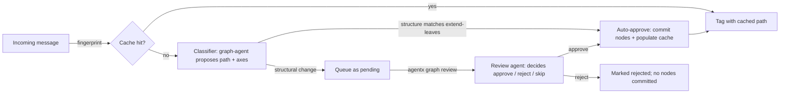

# Intent Knowledge Graph

## What this is, in plain English

AgentX learns to recognize the *kind* of work each incoming message is — "this is a deploy request", "this is a customer complaint", "this is just chitchat". The labels live in a small taxonomy (a tree of categories) you can review and edit. Once a kind of message is labeled, the agent can use the label to pick the right team or skip work that doesn't apply.

When a new message comes in, agentx asks an LLM to label it. New labels go to a review queue (one click to approve or reject). Once approved, the label is cached — the same kind of message next time costs no LLM call. Approved labels also tag your wiki articles, so when an agent later searches for institutional knowledge it can prefer content from the same sub-tree.

You don't have to use this. It's optional. The classifier is **off by default**; turn it on in `agentx.json` under `graph.enabled` if you want to start labeling. Until then, agents fall back to simple regex tags and nothing changes about your existing setup.

A hierarchical, enumerable intent taxonomy that classifies every incoming message into a path through a fixed-axis schema. Typed paths feed Layer 6 of the context engine and can tag wiki articles so retrieval can prefer content from the same sub-tree.

## The shape

Five levels, fixed axes per level:

```
scope     (business | personal | other)
  └── location     (country, city)
        └── org    (name, orgKind)
              └── unit     (unitKind, name, role?, lead?)
                    └── activity (who, what, where)
```

Paths can **skip intermediate levels** when they don't apply — a remote-first org that never uses `location` will commit `scope → org → unit → activity` directly. Level inference matches each node's axes against each level's required axes rather than naive index-by-position.

Axes are typed: `enum` (closed set), `free` (any string), `ref` (pointer to another node). Axes can be `optional: true` for cases like `unit.lead` that only apply to sub-groups, not individuals.

Each agent's taxonomy lives on disk under `.agentx/graph/`:

```
.agentx/graph/
  schema.json              — level + axis definitions (seeded from starter-schema.ts)
  nodes.json               — committed nodes in the taxonomy tree
  classifications.jsonl    — append-only log (pending / approved / rejected entries)
  index.json               — fingerprint → path cache (hot-path for recurring messages)
```

## The lifecycle



Three failure modes are all handled gracefully:

- **LLM proposes invalid node-id slugs** (Arabic input, unicode, caps) → filtered against `[a-z0-9][a-z0-9_-]*`; malformed elements drop.
- **New nodes fail schema validation** (missing required axes) → classification falls back to pending, task continues.
- **Classifier times out** (60s ceiling) → task uses old regex-based intent tags, doesn't block.

## Auto-approval policy

Controlled by `graph.autoApproveStructure` in config:

| Policy | When classification auto-approves |
|---|---|
| `strict` | Never. Every classification waits for human or review-agent approval. |
| `extend-leaves` (default) | When the path either (a) reuses only existing nodes, or (b) adds exactly one new node at the deepest level. Structural changes still queue. |
| `any` | Always. No review, no queue. |

`graph.autoApproveConfidence` (0..1) is OR'd with the structural policy — if the LLM reports confidence ≥ threshold the classification auto-approves regardless of structure. Default 1.0 (disabled).

Rationale: most real classifications add one new leaf ("a new activity") — those grow the graph organically without review friction. Structural changes (a new org, a new unit) are the ones operators want to see.

## Reviewing pending classifications

When something structural hits `pending`, run:

```bash
agentx graph review [--dry-run] [--max N] [--agent <id>]
```

The review agent — configured as `graph.reviewAgent` — sees the original message, the proposed path + axes, and a compact view of the current catalog (existing nodes per level). It MAY call `agentx wiki query` via Bash to verify context (e.g. "is there an article for this project?") before deciding:

- `approve` — commit the new nodes, populate the fingerprint cache for next time
- `reject` — mark as rejected in the ledger
- `skip` — leave pending for human review

**Explicit bias in the review prompt: reject over approve when uncertain.** A wrong approval pollutes the graph; a wrong rejection just keeps the entry pending.

Schedule it as a cron for hands-off operation:

```json
"graph-review-hourly": {
  "enabled": true,
  "schedule": "0 * * * *",
  "agent": "graph-agent",
  "prompt": "Run: node dist/cli.js graph review --max 20. Report the summary line."
}
```

## Configuration

In `agentx.json`:

```json
{
  "graph": {
    "enabled": true,
    "baseDir": ".agentx/graph",
    "draftAgent": "graph-agent",
    "reviewAgent": "graph-agent",
    "autoApproveStructure": "extend-leaves",
    "autoApproveConfidence": 1.0,
    "retrievalWeights": { "graph": 0.6, "bm25": 0.4 }
  }
}
```

| Field | Default | Purpose |
|---|---|---|
| `enabled` | `false` | Off by default — existing installs see no change until they flip this |
| `baseDir` | `.agentx/graph` | Where schema/nodes/classifications/index live on disk |
| `draftAgent` | (none) | Agent the classifier calls with a proposal prompt. Should be a dedicated, channel-less agent with a sonnet-or-better model |
| `reviewAgent` | falls back to `draftAgent` | Agent the `graph review` command calls. Needs the `wiki` skill so it can `wiki query` for context |
| `autoApproveStructure` | `"extend-leaves"` | See table above |
| `autoApproveConfidence` | `1.0` | LLM-confidence threshold to auto-approve regardless of structure |
| `retrievalWeights` | `{ graph: 0.6, bm25: 0.4 }` | Weights for hybrid wiki retrieval (ancestry match vs BM25) |

## The dedicated classifier agent

The classifier routes proposals through an agent's Claude Code subprocess. Using a channel-bound agent (like a devops- or marketing-agent) is a bad idea:

- It queues behind real Telegram/HTTP traffic (`maxConcurrent=1`).
- Its CLAUDE.md / skills / context are all loaded every classification — slow + expensive.
- When the classifier's `input.agentId === draftAgent`, the call is skipped (would deadlock), so no classification happens for messages targeting THAT agent.

The recommended pattern is a dedicated `graph-agent`:

- **Workspace**: minimal — `CLAUDE.md` spelling out the JSON-only output contract, `.claude/settings.json` allowing only `Bash(agentx wiki query *)`, and the `wiki` skill installed.
- **Config**: `model: claude-sonnet-4-6`, `maxConcurrent: 3`, `mentions: []`, `access: "private"`. No channels — nobody messages this agent directly.
- **Size**: sonnet, not haiku. Classification involves picking 4–5 node ids and axis values; haiku's output was noisy enough in testing to be worth the sonnet cost delta.

See the classifier + review end-to-end in the [commit story](https://github.com/anis-marrouchi/agentx/commit/c70db0f).

## Setting it up across a mesh

Two-node example (laptop + cloud server). Graph stores are peer-local; cross-pollination happens via bidirectional `graph pull`. No tokens needed — `/graph/*` endpoints are read-only and unauthenticated.

**1. Enable graph on each node.** Add to each peer's `agentx.json`:

```json
"graph": { "enabled": true, "draftAgent": "graph-agent",
           "reviewAgent": "graph-agent",
           "autoApproveStructure": "extend-leaves" }
```

Define a dedicated `graph-agent` (sonnet, `maxConcurrent: 3`, no channels). Restart the daemon on each peer.

**2. Seed the schema.** On the bootstrap node, the first daemon start creates `.agentx/graph/schema.json` from the default. Copy that file to the other peer so both use the same level + axis definitions — schema drift blocks cross-node node-imports.

**3. Seed the root nodes.** The scope (`business` / `personal`) and the first org node must exist before the classifier can anchor paths. Either (a) hand-write a two-line `nodes.json` with `business + noqta` and similar, or (b) run the bootstrap node for a day so real traffic populates it, then `graph pull` into the new peer.

**4. First sync — pull the established node INTO the fresh one.** From the fresh peer:

```bash
agentx graph pull --from http://<peer-tailscale-ip>:19900
# graph pull ← http://100.82.31.24:18800
#   schema matches (5 levels)
#   nodes: +15 added · 0 already-present · 0 failed
#   fingerprints: +14 cached · 0 already-present
```

This copies the root scope/org nodes, every committed unit + activity node, and the approved-classifications fingerprint cache — so messages resembling ones the peer has already seen snap to the same path without an LLM call.

**5. Run the review pass.** Any classifications that arrived on the fresh peer before nodes existed now have parents to commit against:

```bash
agentx graph review --max 20
# [1/1] f975e91e business › Noqta › seif-arbi › bugfix-mosheer-step2 ... APPROVE
# Summary: did approve 1, did reject 0, 0 skipped, 0 errors.
```

**6. Reverse sync — peer-B back to peer-A.** So classifications approved on the newer peer feed back:

```bash
# On the original node:
agentx graph pull --from http://<other-peer-tailscale-ip>:19900
# nodes: +2 added · 15 already-present · 0 failed
# fingerprints: +1 cached · 0 already-present
```

**7. Schedule recurring pulls.** A cron every few hours keeps the two graphs in sympathy without either becoming the source of truth:

```json
"graph-sync-peer": {
  "enabled": true,
  "schedule": "17 */3 * * *",
  "agent": "atlas",
  "prompt": "Run: node dist/cli.js graph pull --from http://peer-host:19900. Report the summary line."
}
```

## Troubleshooting

| Symptom | Likely cause |
|---|---|
| `classifications.jsonl` is empty after many messages | `graph.enabled: false`, or `draftAgent` unset, or the draftAgent IS the target of every message (classifier skips self-routing) |
| `[classifier] LLM proposal failed: This operation was aborted` | Classifier's 60s fetch ceiling — the draftAgent is queued behind other tasks. Check `maxConcurrent` on the draftAgent, or use a dedicated `graph-agent` |
| Everything stays pending | `autoApproveStructure: "strict"` (change to `"extend-leaves"`) or no approval happening (run `agentx graph review`) |
| `skipped invalid classification — path=[...]` in log | LLM proposed a node id that doesn't pass `[a-z0-9][a-z0-9_-]*`. Non-blocking; the classification drops and the task continues |
| `Node X (level) missing required axes: ...` | Classifier didn't fill a required axis. Check the schema's axis `optional` flags; if the axis should be optional, mark it |
| `(commit failed, staying pending: Node business missing required axes: kind)` on a fresh peer | Root scope node doesn't exist yet. Either `graph pull` from a peer that has it, or seed `nodes.json` with `{ "id": "business", "level": "scope", "axes": { "kind": "business" } }` |

## Related

- [CLI reference — `agentx graph review`](/reference/cli#graph-intent-knowledge)
- [Config schema](/reference/config-schema)
- [Journey 6 — shared wiki](/journey/06-shared-wiki) — the wiki that graph-tagged articles feed into
- Source: [`src/graph/`](https://github.com/anis-marrouchi/agentx/tree/master/src/graph), [`src/commands/graph.ts`](https://github.com/anis-marrouchi/agentx/blob/master/src/commands/graph.ts)
