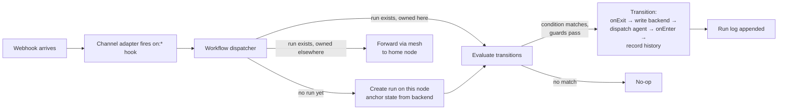

# Workflows

Declarative state machines that bind channel events to agents. A workflow says *"at state X, run agent Y with prompt Z; transition to state W when condition C holds."* The engine sits on top of the existing hook + channel + agent-registry primitives — it subscribes to hooks that already fire (`on:gitlab-issue`, `on:gitlab-pipeline`, `post:response`) and dispatches agents through the same registry your channels already use.

Think of it as the layer between *"a webhook fired"* and *"a specific agent got a specific prompt, and the result moved the issue forward."*

## Concepts in plain English

A workflow has five moving parts. You'll meet them in the visual editor's right panel.

### Trigger — what starts this workflow

When something happens (a GitLab issue is updated, a pipeline finishes, someone runs a CLI command), the daemon checks all your workflows and starts any whose trigger matches.

### State — a step in the lifecycle

Think of a state like a lane in a kanban board (`Triage`, `Doing`, `Review`, `Done`). When a run enters a state, the assigned agent gets a prompt and does its job. The run stays in that state until something triggers a transition to another.

**You define the names and how many you want.** `Triage → Done` is a common 5-state lifecycle, but you might only need `New → Approved`.

### Transition — a line from one state to another, with a condition

A transition says *"when condition C holds, move from state A to state B."* Conditions are typed — label was added, pipeline passed, agent replied with `approved`, etc.

### Guards (requires) — gates before entering a state

A state can say *"I won't accept a run until this is true"* — e.g. `To Do` requires an assignee. If a transition points to `To Do` but no one's assigned, the run stays put and waits.

### Actions (onEnter / onExit) — side effects

Once a run enters or leaves a state, a list of small actions can fire: post a comment, log time spent, add a label, notify another channel, call an HTTP endpoint. These are fire-and-forget — they don't change the run's direction.

---

## What's actually working?

Schema is broader than the runtime. Here's the honest map:

| Trigger source | What fires it | Status |
|---|---|---|
| `gitlab-issue` | GitLab issue webhook (open / update / close) | ✅ Wired |
| `gitlab-pipeline` | GitLab MR pipeline webhook | ✅ Wired |
| `manual` | `agentx workflow run <id>` / `POST /workflows/:id/run` | ✅ Wired |
| `github-issue`, `github-pr` | GitHub webhooks | ⚠️ Schema-only, no subscriber yet |
| `telegram-message`, `whatsapp-message` | Channel messages | ⚠️ Schema-only |
| `cron` | Scheduled | ⚠️ Schema-only |
| `hook` | Custom `on:*` hook script | ⚠️ Schema-only |

| State backend | Tracks the current state in… | Status |
|---|---|---|
| `gitlab-label` | A GitLab issue/MR label | ✅ Wired |
| `agentx-internal` | A local file | ⚠️ Schema-only |
| `github-label` | A GitHub issue/PR label | ⚠️ Schema-only |
| `script` | User-provided script | ⚠️ Schema-only |

Fields marked **schema-only** save fine in the editor and appear in the CLI, but no event handler emits them yet — the workflow won't fire on its own. Adding a subscriber for any of them is ~15 lines in `src/workflows/hooks.ts`.

## Where do I watch executed runs?

Go to **`/workflows`** in the dashboard. Each workflow card shows a live count of running executions and the last run's status. Click a card to expand the detail pane — under "Recent runs" you get a table (run id · entity · status · timestamp). Click any run for an SSE-streamed timeline showing exactly which transitions fired, which agent ran, and what came back.

From inside the editor, the toolbar's **"History"** button jumps you straight to that workflow's detail on the runs page.

## Advanced settings demystified

Three settings appear under "Advanced" in the editor. Most users never touch them.

### Priority and Fan out — what happens when two workflows match the same event

Say you have a general `noqta/*` lifecycle and a project-specific `noqta/web` lifecycle, and both match a GitLab issue change. Two ways to resolve:

- **Priority** — each workflow has a number. Highest priority wins; others skip for this event. Default 0, ties broken alphabetically by id.
- **Fan out** — if any matching workflow has `fanOut: true`, then **every** match runs, each with its own independent run. Useful if both lifecycles have different jobs (e.g. a security scanner and a triage flow should both fire). Default: off.

Leave both alone until you actually have overlapping workflows.

### Retention — how long run history is kept

- `maxRuns: 500` — keep at most 500 finished (completed/failed/canceled) runs per workflow. Oldest pruned first.
- `maxDays: 90` — runs older than 90 days are pruned on daemon start and daily.

Running/paused runs are **never** pruned. Defaults are fine for most teams.

<div v-pre>

### Env allowlist — only if your prompt uses `{{env.X}}`

The templating engine lets prompts reference environment variables like `{{env.GITLAB_HOST}}`. For safety, only names you explicitly list here are readable — any other `{{env.FOO}}` renders as empty string. This prevents a typo like `{{env.DATABASE_PASSWORD}}` from leaking a secret into agent prompts.

**Most workflows don't use `{{env.*}}` at all** — the event context (`{{issue.title}}`, `{{pipeline.status}}`, etc.) is enough. Leave the allowlist empty unless you're deliberately templating from env.

</div>

## When to use this (and when not)

Use workflows when you have a repeatable lifecycle that spans multiple states and multiple agents — e.g. GitLab issues driven through `Triage → To Do → Doing → Review → Done`, release pipelines, incident response, onboarding flows on Telegram/WhatsApp.

Don't use workflows for:

- One-shot event handlers. A single `on:gitlab-issue` script hook is simpler.
- Agent-to-agent dispatch with no persistent state. Use the handover store.
- General-purpose automation (n8n-style). AgentX is an agent orchestrator; workflows orchestrate agents, not arbitrary HTTP steps.

## The shape

```
workflow
  ├── trigger        (source + filter — which events kick this workflow off)
  ├── stateBackend   (where the current state lives — GitLab label, internal, …)
  ├── states         (per-state agent + prompt + onEnter/onExit actions + guards)
  └── transitions    (from → to edges, each with a condition)
```

Defined on disk as one JSON file per workflow under `.agentx/workflows/`:

```
.agentx/workflows/
  gitlab-issue-lifecycle.json     — the workflow itself
  _runs/<runId>.jsonl             — append-only run events (home-node only)
  _index/<backend>__<entity>.json — entity → active runId (so webhooks find it)
```

State of truth for *what state an entity is in* is the `stateBackend` (typically a GitLab label). State of truth for *the run itself* (id, history, ownership) is the jsonl log on the run's home node.

## The lifecycle



Three invariants that make the engine safe to rely on:

- **Idempotency keys.** Every transition carries `hash(runId, from, to, eventId)`. A webhook delivered twice collapses into a single recorded transition. Non-negotiable — GitLab and GitHub both replay.
- **Home-node per run.** The node that handled the triggering webhook owns the run. All subsequent state mutations route through that node. Cross-node deployments are safe by construction; no distributed state problem.
- **Actions are side-effects, not guards.** If `onExit`'s `postComment` fails, the transition still records. Guards belong in `requires` and `transitions[].when`.

## Authoring a workflow

Minimal example — a GitLab issue lifecycle for one project:

```json
{
  "id": "gitlab-issue-lifecycle",
  "version": 1,
  "title": "GitLab Issue Lifecycle",
  "priority": 10,
  "trigger": {
    "source": "gitlab-issue",
    "filter": { "project": "noqta/web" }
  },
  "stateBackend": {
    "kind": "gitlab-label",
    "config": {
      "host": "https://gitlab.noqta.tn",
      "token": "${GITLAB_TOKEN}",
      "kind": "issue"
    }
  },
  "states": {
    "Triage":  { "agent": "triage-agent", "prompt": "Assess #{{issue.iid}} — {{issue.title}}" },
    "To Do":   { "agent": "planner",      "prompt": "Plan {{issue.title}}",
                 "requires": [{ "kind": "assigneePresent" }] },
    "Doing":   { "agent": "dev-agent",    "prompt": "Implement {{issue.title}}",
                 "onExit": [{ "kind": "logTime" }] },
    "Review":  { "agent": "code-reviewer","prompt": "Review MR for #{{issue.iid}}",
                 "requires": [{ "kind": "pipelineStatus", "value": "success" }] },
    "Done":    { "terminal": true }
  },
  "transitions": [
    { "from": "Triage",  "to": "To Do",  "when": { "kind": "labelPresent", "value": "To Do" } },
    { "from": "To Do",   "to": "Doing",  "when": { "kind": "labelPresent", "value": "Doing" } },
    { "from": "Doing",   "to": "Review", "when": { "kind": "pipelineStatus", "value": "success" } },
    { "from": "Review",  "to": "Done",   "when": { "kind": "agentResult", "value": "approved" } }
  ]
}
```

A complete version with retries, `onEnter` comments, and a `changes-requested` loop-back is committed at [`examples/workflows/gitlab-issue-lifecycle.json`](https://github.com/anis-marrouchi/agentx/blob/master/examples/workflows/gitlab-issue-lifecycle.json).

## Conditions

| Kind                 | Matches when… | Params |
|----------------------|-----|-----|
| `labelPresent`       | the event payload includes a specific label | `{ label }` or `{ value }` |
| `assigneePresent`    | at least one assignee is set | — |
| `pipelineStatus`     | the event's CI status equals the expected value | `{ value: "success" \| "failed" \| "canceled" }` |
| `agentResult`        | the last agent's reply contained the expected tag | `{ value: "approved" \| "..." }` |
| `timeInState`        | the run has been in the current state within [min,max] minutes | `{ minMinutes?, maxMinutes? }` |
| `expr`               | reserved — not evaluated in v1 | — |

Guards use the same kinds. Put them in `states.<name>.requires` to block *entering* a state until the guard passes.

## Actions

Actions run as side-effects on `onEnter` / `onExit`. They never block a transition — a failed action logs and the run still progresses.

| Kind            | What it does | Params |
|-----------------|-----|-----|
| `postComment`   | post a comment to the entity's thread | `{ body, channel? }` |
| `logTime`       | log time spent in the state (GitLab `add_spent_time`) | `{ channel? }` |
| `setLabel`      | add/remove labels outside the state machine (e.g. `reviewed-by-bot`) | `{ add?: string[], remove?: string[], channel? }` |
| `notify`        | send a message on a different channel | `{ channel, chatId, text }` |
| `callHTTP`      | fire a request at an external URL | `{ url, method?, body?, headers? }` |
| `dispatchAgent` | reserved — side-effect agent runs; use `state.agent` for primary dispatch | — |
| `script`        | reserved — disabled in v1 for security | — |

All string parameters are rendered through the template engine described below.

## Templating

Named-helper substitution only in v1 — no arbitrary expressions. Dotted paths resolve against a typed context:

```
{{issue.title}}      {{issue.iid}}      {{issue.url}}
{{labels}}           {{assignees}}      {{pipeline.status}}
{{run.id}}           {{run.state}}      {{run.workflow}}
{{state.previous}}   {{state.next}}
{{env.FOO}}          (only if FOO is in workflow.envAllow)
```

<div v-pre>

Unknown paths render as empty string, never literal `{{...}}` — so a typo in a prompt produces a gap in the rendered text instead of leaking template syntax to agents.

`env.*` is allowlisted. Only names listed in `workflow.envAllow` are readable. This is deliberate — a workflow author writing `{{env.DATABASE_PASSWORD}}` by mistake should get nothing, not a leak.

</div>

## State backends

| Kind             | Source of truth | Phase |
|------------------|----|----|
| `gitlab-label`   | A GitLab issue/MR label from a fixed set | v1 |
| `github-label`   | A GitHub issue/PR label | Phase 3 |
| `agentx-internal`| A local file under `.agentx/workflows/_state/` | Phase 3 |
| `script`         | Custom read/write via a user-provided script | Phase 3 |

Backends are pluggable — adding a new one means one file implementing the `StateBackend` interface and one line in `BackendRegistry.create()`. There is no engine-level change.

## Visual editor

The dashboard ships a node-canvas editor at `/workflows/editor?id=<id>` (or `/workflows/editor?new=1` for a fresh workflow). It reads and writes the same JSON files under `.agentx/workflows/` — the editor is a view over disk, not a parallel representation — and stores node coordinates in a sibling `_layouts/<id>.json` so the Workflow schema stays pure behavior.

### What the editor does

- **States** appear as rectangles; drag them freely (snap-to-8px grid). The initial state is marked with an accent dot on its top-left corner; terminal states have a dashed outline.
- **Transitions** are Bezier edges with an arrow and a condition label (`labelPresent = "To Do"`, `pipelineStatus = "success"`, etc.).
- **Create a transition** by hovering a state — a small handle appears on its right edge — then dragging onto another state.
- **Property inspector** on the right panel covers every field: agent, prompt, requires/onEnter/onExit (as JSON), terminal flag, timeoutMinutes, retries, and for transitions: from / to / when. Workflow-level fields (id, title, priority, trigger, state backend) surface when nothing is selected.
- **Raw JSON view** (⌘⇧J) toggles a full-text editable view of the workflow. Apply round-trips the parsed JSON back to the canvas.
- **Auto-layout** (⌘⇧L) arranges states in topological columns — useful after importing a workflow or editing the JSON directly.
- **Save** (⌘S) first validates the workflow server-side; any schema or lint errors highlight the offending node/edge in red and list the issues in the lower-left panel.

### Keyboard shortcuts

| Key | Action |
|-----|--------|
| `n` | Add a new state at the viewport center |
| right-click on empty canvas | Add a new state at the cursor |
| `Delete` / `Backspace` | Delete the selected state or transition |
| `Escape` | Deselect, or cancel an in-progress transition drag |
| `⌘S` / `Ctrl+S` | Save (with validation) |
| `⌘Z` / `Ctrl+Z` | Undo |
| `⌘⇧Z` / `Ctrl+Shift+Z` | Redo |
| `⌘⇧L` / `Ctrl+Shift+L` | Auto-layout |
| `⌘⇧J` / `Ctrl+Shift+J` | Toggle raw JSON view |
| `Space + drag`, `Shift + drag`, middle-click drag | Pan the canvas |
| mouse wheel | Zoom (0.25× to 2.5×) |

### Persistence model

- `/.agentx/workflows/<id>.json` — the workflow definition itself. Source of truth for behavior.
- `/.agentx/workflows/_layouts/<id>.json` — node coordinates. Safe to delete; the editor will auto-layout on next open.
- Saves pass through the same Zod schema + linter the CLI uses (`agentx workflow validate`). You cannot persist a broken workflow through the editor.

### When to use the editor vs. the CLI

The editor is the fastest way to explore an unfamiliar workflow's graph or to prototype a new lifecycle by sketching nodes before filling in prompts. The CLI (`agentx workflow validate`) is what you run in CI, and plain YAML/JSON in git is what diffs cleanly on pull requests. They round-trip cleanly — use whichever fits the moment.

## CLI

```
agentx workflow list                    # all workflows with their trigger + state count
agentx workflow show <id>               # full JSON for one workflow
agentx workflow validate [file]         # schema + lint check (CI-friendly)
agentx workflow runs [id]               # recent runs, with state + agent history
agentx workflow run <id> --input <json> # manually fire a `trigger: manual` workflow
agentx workflow pause <runId>           # freeze a run (no transitions fire)
agentx workflow resume <runId>          # un-pause
agentx workflow cancel <runId>          # end it; no further transitions
```

`validate` exits non-zero on any failure, so put it in CI to prevent broken workflows from being committed.

## Multi-match and priority

If two workflows match the same event — e.g. a generic `noqta/*` workflow and a project-specific `noqta/web` workflow — the engine decides what to do based on the `priority` and `fanOut` fields:

- `fanOut: false` (default) + different priorities → highest-priority workflow runs, others skip for this event.
- `fanOut: false` + same priority → first by `id` (alphabetical) wins; others skip.
- `fanOut: true` on any matching workflow → **every** match runs in parallel with its own run.

Lint the graph with `agentx workflow validate` before deploying — the linter flags overlapping triggers so you don't discover multi-match semantics in production.

## Mesh federation

Workflows are mesh-aware. When a webhook arrives at node B for an entity owned by node A:

1. Node B consults `_index/<backend>__<entity>.json`, finds home is `A`.
2. Node B forwards the event to A via the mesh RPC (`workflow.transition`).
3. Node A re-evaluates locally and dispatches agents as if the webhook had landed there.

This keeps run-state single-owner (no distributed-state problem) while still letting any node receive webhooks. The home node is sticky until the run completes — it does not rebalance mid-run.

## Retention

Each workflow declares a `retention` policy:

```json
"retention": { "maxRuns": 500, "maxDays": 90 }
```

Running and paused runs are never pruned. Completed/failed/canceled runs get pruned oldest-first once they exceed `maxRuns` or `maxDays`. Prune runs on daemon start + daily.

## Troubleshooting

| Symptom | Likely cause |
|---------|--------------|
| Workflow exists on disk but nothing fires | Trigger filter mismatch. Run `agentx workflow show <id>` and cross-check `trigger.filter.project/repo/chat` against the webhook payload. |
| Run created, agent never runs | State has no `agent` or the agent id doesn't exist in `agentx.json`. `agentx agent list` to confirm. |
| `blocked by requires: assigneePresent` in logs | The destination state has a guard that isn't satisfied. Either the guard is wrong or the event lacks the expected data (e.g. GitLab issue has no assignee). |
| Transitions fire twice | You're running two daemons against the same `.agentx/` directory. The engine's idempotency key is per-run-store, not global — point each daemon at its own state dir. |
| "run … is home'd on 'xxx' but no mesh forwarder configured" | Workflows is enabled on this node but `mesh` is not. Enable mesh or stop the duplicate daemon. |
| Templating renders curly braces literally | Pattern is outside the supported grammar — only bareword dotted paths resolve (spaces, quotes, or operators inside the braces are ignored). |
| Workflow runs but label doesn't change | Backend token lacks write scope on the project, or the label isn't in `workflow.states`. Backend validation requires the write target to be in the declared state set. |

## Related

- [CLI reference — `agentx workflow`](/reference/cli#workflow-declarative-state-machines)
- [Config schema — `workflows` section](/reference/config-schema)
- [Example workflow](https://github.com/anis-marrouchi/agentx/blob/master/examples/workflows/gitlab-issue-lifecycle.json)
- Source: [`src/workflows/`](https://github.com/anis-marrouchi/agentx/tree/master/src/workflows), [`src/commands/workflow.ts`](https://github.com/anis-marrouchi/agentx/blob/master/src/commands/workflow.ts)
